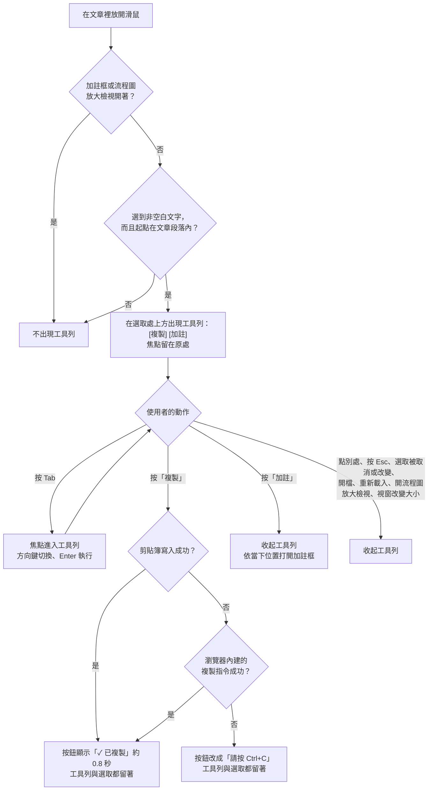
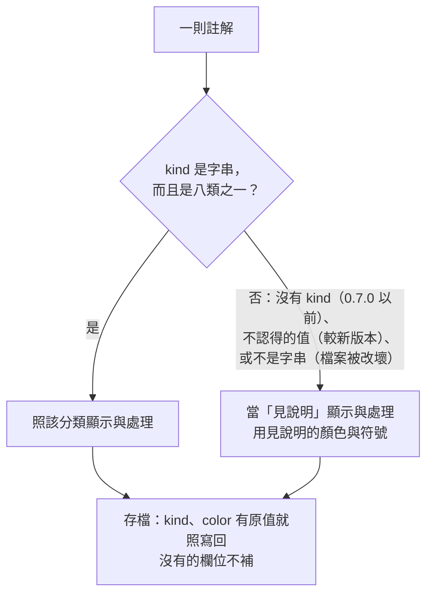
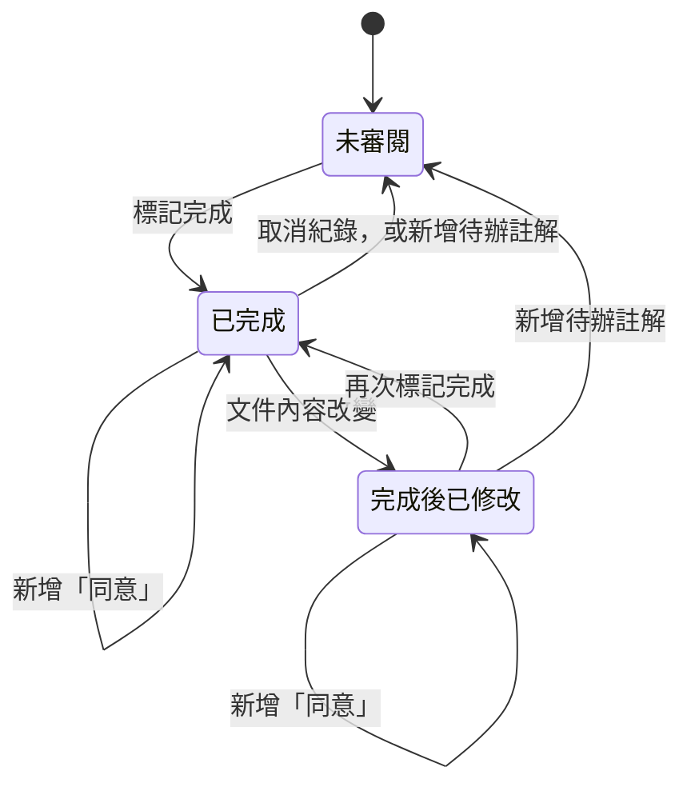

## Context

這份設計處理兩件事：選取文字後先出現 [複製]／[加註] 小工具列，以及用使用者定案的八種「註解分類」取代目前沒有意義的四種螢光顏色。動機與使用者原話見 proposal.md，這裡先整理現在的程式是怎麼運作的（都是從程式碼讀到的）。

**選取文字之後發生什麼事。** `reviewer.js` 的「selection → popover」段落在文章捲動區 `#doc` 上聽 mouseup（放開滑鼠）事件：

1. 等 10 毫秒讓瀏覽器把選取範圍定下來，取得選取的文字，把所有空白壓成一格、去掉頭尾空白；文字是空的就什麼都不做。
2. 從選取的起點往上找最近一個帶 `data-line` 屬性的元素。`data-line` 是渲染 Markdown 時標在每個區塊（段落、標題、清單項目、表格、程式碼塊、流程圖等）上的來源行號，找得到才算「選在文章段落裡」。
3. 把行號和引文記在 `state.pending`，呼叫 `openPopover` 打開加註框 `#pop`。

加註框是固定在視窗上的浮動框，`openPopover` 把它放在選取範圍下方，寬度寫死當成 300px 來計算是否超出右邊，往上翻時也沒有確保不超出視窗頂端。它會清空意見輸入框、把顏色重設為黃色、把焦點移進輸入框。加註框只有三種關法：按「取消」、在輸入框裡按 Esc、存檔。這帶來兩個現存的問題：

- 每次在文章裡選字都會重跑 `openPopover`，所以加註框開著時又選了別的字，引文會被換掉、已經打的意見會被清空，而且沒有任何提示。
- `loadFile`（開啟或重新載入文件）不會關閉加註框，`state.pending` 還留著舊文件的行號與引文；這時按存檔，舊引文就被記到新文件上。

**顏色現在怎麼用。** `COLORS`（yellow、green、pink、blue）和 `COLORHEX` 定義四種顏色；`renderSwatch` 在加註框畫四個圓點；`saveAnnotation` 把選到的顏色存成註解的 `color`；`wrapQuote` 用 `<mark class="anno <color>">` 在文章裡上螢光，`<color>` 直接取自註解檔的原值；`renderSide` 在右側卡片用 `COLORHEX` 畫一個小圓點。README 與規格都沒有定義顏色的意思。另外，`applyLocale`（切換介面語言）會重畫卡片，但不會重跑 `applyHighlights`，螢光的滑鼠提示不會換語言。

**「📋 複製給 Claude」。** `#btnCopy` 的點擊處理會組出一段純文字：標題、「共 N 則（未解決 M）」、每則未解決註解一段（`[序號] L行號「引文」原文狀態註記`，下一行 `→ 意見`），最後是已解決的清單。寫剪貼簿用 `navigator.clipboard.writeText`（瀏覽器提供的剪貼簿寫入功能），失敗就跳出 `prompt()` 對話框讓人手動複製。頁面由 `127.0.0.1` 提供，瀏覽器把它視為安全來源，所以這個功能可以用，但仍可能因為瀏覽器政策或權限被拒絕。

**註解檔怎麼寫。** 註解檔（sidecar，文件旁的 `<檔名>.review.json`）由前端 `buildSidecar` 組出來，它對每則註解只送出固定的欄位（`line`、`quote`、`comment`、`color`、`status`、`id`、`createdAt`、`context`）。伺服器 `server.cjs` 的 `writeSidecar` 只替換 `annotations`，其他頂層欄位原樣保留（`sidecar-integrity` 規格）。開檔時 `renderDoc` 會在記憶體裡更新註解的 `line`，舊註解有把握時補上 `context`，這兩個是刻意要在下次存檔時落地的已知欄位；對位結果與差異則放在 `state.anchors`、`state.diffs` 兩個以 id 查詢的表裡，不掛在註解物件上。固定欄位的代價是：較新版本加在註解上的欄位，舊版存檔時會被丟掉，這次新增的 `kind` 在 0.6.0 就會被丟掉。另外 0.6.0 的卡片直接把 `comment` 交給 `escapeHtml`，註解如果沒有 `comment` 欄位，整個卡片列表會出錯。

**未解決數與審閱完成紀錄。** 伺服器 `annCounts` 用 `status !== "resolved"` 計算未解決數，顯示在左側清單每一列的徽章上。前端按「標記審閱完成」時，若還有未解決註解會先確認並說出數量。對已標記完成的文件新增註解時，`saveAnnotation` 會呼叫 `setReview(false)` 清除完成紀錄，並在提示列告訴使用者（`review-status` 規格）。伺服器已經 `require` 共用模組 `reviewer-diff.js`（文字正規化），前端也載入同一份。

**流程圖。** 渲染後的流程圖區塊 `.mermaid` 也帶 `data-line`，所以在圖裡的文字上拖曳選取，現在也會打開加註框，可以對圖加註。在圖上按兩下會打開放大檢視（`#mmModal`），按兩下同時也會選取一個字。

**限制。** 零依賴、沒有建置步驟；en 與 zh-Hant 兩份語系檔的 key 必須完全一致（`ui-i18n` 規格）；舊的註解檔必須能照常開啟，不需要轉換。

## Goals / Non-Goals

**Goals:**

- 選取文字後先給兩個選擇：只是複製，或是要加註。複製不必經過加註框，複製完還能接著加註。
- [複製] 在剪貼簿功能被拒時仍有退路，使用者永遠知道有沒有複製成功。
- 工具列可以只用鍵盤操作、螢幕閱讀器讀得出來，而且不打斷原本的鍵盤習慣（空白鍵捲動、Shift＋方向鍵、直接打字）。
- 加註框開著時，新的選取不會毀掉正在寫的意見；換檔時草稿不會寫進別的文件。
- 每則註解帶一個有明確「出路」的分類，審閱者在加註框裡一眼就能選；Claude 不論讀註解檔或貼上的文字，都知道每一類該怎麼處理。
- 八類在淺色與深色模式都看得清楚，而且不只靠顏色辨識：色弱的使用者也能分出任兩類。
- 舊的註解檔不用改寫就能開；新版存檔不會丟掉看不懂的欄位。

**Non-Goals:**

- 在卡片上修改意見文字、依分類篩選卡片、使用者自訂分類與顏色。
- 把舊註解的顏色換算成分類。
- 只用鍵盤選取文字（瀏覽器的「插入點瀏覽」模式）時跳出工具列。閱讀區平常沒有文字游標，必須先開啟瀏覽器的插入點瀏覽才能用鍵盤選字；現在這種選取也不會跳出加註框。要支援需要另一種觸發方式（例如放開 Shift 鍵），留待日後。
- 觸控裝置專用的操作、帶格式（HTML）的複製、工具列放更多按鈕。

## Decisions

### D1. 選取流程總覽



### D2. 工具列何時出現

- 觸發時機與現在相同：`#doc` 上的 mouseup，等瀏覽器定好選取範圍後再判斷。雙擊選一個詞、三擊選一整段，也都會觸發。
- 出現的條件沿用現在的判斷：選取的文字去掉空白後不是空的，而且選取的起點往上找得到帶 `data-line` 的文章區塊。沒有開文件時的歡迎畫面、左右兩側欄都不符合。
- 以下情況不出現：
  - 加註框開著（D8）。
  - 流程圖的放大檢視開著。在流程圖上按兩下會同時「選取一個字」與「打開放大檢視」，放大檢視先打開，10 毫秒後的判斷看到它開著，就不出現工具列。
  - 放開滑鼠的位置在工具列本身、加註框、「回到頂端」按鈕或流程圖的放大按鈕上。
- 在流程圖裡用拖曳選取文字，仍然會出現工具列，對流程圖加註的能力維持不變。替代方案「選取起點在 `.mermaid` 裡就一律不出現」較簡單，但會拿掉現在可以對圖裡某個步驟加註的能力，所以沒有採用。
- 工具列記住選取當下的三樣東西：行號、引文（空白壓成一格，給加註用，與現在一樣），以及原始選取文字（`Selection.toString()` 的結果，保留跨段落的換行，給複製用）。

### D3. 工具列放在哪裡、長什麼樣子

- 工具列是一個新元素，放在 `#doc` 裡、`#docInner` 後面、「回到頂端」按鈕前面。這樣 `renderDoc` 重畫文章內容時不會把它清掉。
- 它用絕對定位，座標換算成「文章捲動區內容」的座標（`#doc` 設為 `position: relative`），所以使用者捲動文章時，工具列會跟著文字一起移動。審閱時常會稍微捲一下看前後文再決定，捲一下就收起會很煩，所以不採用「固定在視窗上、一捲動就收起」的做法。
- 位置：水平方向對齊放開滑鼠的位置，再往內收，不超出閱讀區；垂直方向放在放開滑鼠那一行選取範圍的上方，上方空間不夠時改放下方。
- 工具列設 `user-select: none`，在它上面按滑鼠不會改動選取；按鈕在 mousedown 時阻止瀏覽器的預設行為，按下去也不會把選取取消。
- 隱藏時用 `hidden` 屬性（效果等同 `display: none`），所以隱藏中的按鈕不會被 Tab 走到，也不會被螢幕閱讀器讀到。

### D4. [複製]：只放純文字，失敗時有兩段退路

- 複製的內容是 D2 記下的原始選取文字（純文字），這是使用者的要求「只複製選取的文字」。不使用存進註解的引文，因為引文已經把換行壓成空白，跨段落的選取貼出去會黏成一行。
- 第一段：`navigator.clipboard.writeText`。
- 第二段：第一段被拒絕時，改用瀏覽器內建的複製指令 `document.execCommand("copy")`。執行前先掛一個只觸發一次的 `copy` 事件處理，把剪貼簿內容設成同一段純文字並阻止預設內容，所以第二段也只放純文字，不會連格式一起帶走。這個指令已被標為「不建議使用」，但主流瀏覽器都還支援，這裡只當退路。
- 第三段：兩段都失敗時，按鈕文字改成「請按 Ctrl+C」（macOS 上顯示「請按 ⌘C」），工具列和選取都留著，使用者直接按快捷鍵即可。不沿用「複製給 Claude」的 `prompt()` 對話框：只是複製一小段選取時，彈出對話框太重，而選取本來就還在。
- 成功時，按鈕文字變成「✓ 已複製」，約 0.8 秒後恢復成「複製」。工具列不自動收起，方便複製完接著按 [加註]。
- 朗讀：頁面上有一個常駐、畫面上看不到的朗讀區（`aria-live="polite"`，內容一變螢幕閱讀器就會唸出來），放在工具列外面。成功時寫入「已複製選取的文字」，第三段失敗時寫入「無法自動複製，請按 Ctrl+C」。放在工具列外面，是因為工具列隱藏時，裡面的朗讀區也會跟著消失，訊息可能唸不出來。

### D5. [加註]：加註框的位置在當下重算

- 按 [加註] 時，把 D2 記下的行號與引文交給 `state.pending`，收起工具列，再打開加註框。
- 加註框的位置在這一刻重新計算，不使用放開滑鼠時記下的座標，因為使用者可能已經捲動過文章：
  - 選取還在而且沒有改變，就用選取範圍目前在視窗上的位置；
  - 否則用工具列收起前在視窗上的位置。
- 先讓加註框顯示出來，再用它實際的寬度與高度（`offsetWidth`、`offsetHeight`）計算，不再寫死 300px。預設放在參考位置下方；下方放不下就放上方；最後左右與上下都夾在視窗內、離邊緣至少 12px。加註框本身設最大高度為視窗高度減 24px，太矮的視窗裡內容可以捲動。
- 加註框打開後，焦點進入意見輸入框、Ctrl+Enter 存檔、取消，都與現在相同。加註框關閉後，焦點回到閱讀區，鍵盤使用者不會失去位置。

### D6. 工具列的收起規則

以下任一情況發生就收起：

- 在工具列以外的地方按下滑鼠。如果這一下是在文章裡開始新的選取，放開時會依 D2 在新位置再出現。
- 按 Esc。焦點在工具列裡時，焦點回到閱讀區。
- 選取被取消或改變。實作上監聽瀏覽器的 `selectionchange` 事件：選取變成空的，或選取的文字跟工具列記下的不一樣，就收起。
- 打開加註框、開啟別的文件、重新載入目前文件、打開流程圖的放大檢視。
- 視窗大小改變（文章重新排版後，工具列的位置會對不上）。

### D7. 鍵盤與無障礙

- 工具列標記為工具列角色（`role="toolbar"`），並有一個螢幕閱讀器讀得出來的名稱（`aria-label`，例如「選取文字的動作」）。兩顆按鈕是真正的 `<button>`。
- **焦點不自動移到工具列。** 若出現時就把焦點搶過去，會造成三個問題：按空白鍵本來是捲動頁面，會變成按下按鈕；用 Shift＋方向鍵微調選取的動作會失效；選完直接打字時，第一個字會被按鈕吃掉。
- **用 Tab 進入。** 工具列顯示中、焦點不在工具列裡時，按 Tab（不含 Shift）會直接進入工具列的第一顆按鈕。這是必要的處理：工具列在網頁結構上位於整篇文章之後，若照瀏覽器原本的 Tab 順序，會先經過選取處後面文章裡的每一個連結才走到工具列。
- **工具列裡的操作**依照 WAI-ARIA 製作指南（W3C 發布的無障礙元件寫法慣例）對工具列的建議：只有一顆按鈕在 Tab 順序裡，左右方向鍵在兩顆按鈕之間移動焦點（Home、End 到頭尾），Enter 或空白鍵執行，Tab 離開工具列，Esc 收起。
- 前一版設計寫「用方向鍵或 Tab 切到 [複製]」，其中 Tab 的部分有誤：在工具列裡按 Tab 是離開工具列，不是在按鈕之間切換。
- 閱讀區 `#doc` 加上 `tabindex="-1"`（可以用程式把焦點放上去，但不在 Tab 順序裡），讓 Esc 與加註框關閉後有地方可以放回焦點；聚焦時不畫外框。

### D8. 加註框開著時與換檔時

- 加註框開著時，在文章裡選字只是一般的選取，不出現工具列，也不改動加註框。要複製可以照常按 Ctrl+C；要換一段加註，就先按「取消」或存檔。這同時修正「加註框開著時再選字，會默默換掉引文並清空意見」的問題。替代方案「加註框裡還沒打字時才允許換掉」判斷較細、好處不大，沒有採用。
- `loadFile` 一開始先呼叫 `closePopover()`，也收起工具列，再做其他事。加註框裡已經打的意見會被捨棄，效果等同按「取消」，不會寫進新文件。這修正「換檔後按存檔，舊引文被記到新文件」的問題。換檔前要不要先確認，見 Q7。
- 加註框裡任何地方按 Esc 都會關閉（現在只有在意見輸入框裡按才有效），焦點在分類選項上時也一樣。

### D9. 八種分類與它們的出路

使用者定案的八類，依「收到之後要做的事」可以分成三組。這個分組決定了加註框裡的排列（D13），也方便 Claude 判斷工作量：

- **不需改寫**：「見說明」（照意見處理，內容不定）、「同意」（什麼都不用做）。
- **改寫這段文字**：「請展開解釋」「刪除這些字」「不反向列舉」。影響範圍是引用的那段文字本身。
- **改變做法**：「提出不同的方式供選擇」「第一性原理重新評估」「此功能取消」。可能牽動整份設計，甚至同一個變更的其他文件。

命名規則：

- 中文名照使用者定案的用語。
- 英文名一律是祈使句形式的動詞片語，也就是對修改者下的指示，詞性一致：See comment、Agree、Explain more、Offer alternatives、Delete this text、Rethink from first principles、State it positively、Drop this feature。「Agree」在文法上同樣是動詞原形，意思是審閱者表態「同意」。
- `kind` 值是英文名的小寫、以連字號相連（kebab-case），太長的去掉代名詞與冠詞。這個值寫在註解檔裡，給直接讀檔的 Claude 看，所以選用不必查表也看得懂的英文。

| 順序 | 中文名 | 英文名 | `kind` 值 | 符號 |
|---|---|---|---|---|
| 1 | 見說明（預設） | See comment | `see-comment` | ※ |
| 2 | 同意 | Agree | `agree` | ✓ |
| 3 | 請展開解釋 | Explain more | `explain-more` | ? |
| 4 | 提出不同的方式供選擇 | Offer alternatives | `offer-alternatives` | ⇄ |
| 5 | 刪除這些字 | Delete this text | `delete-text` | − |
| 6 | 第一性原理重新評估 | Rethink from first principles | `rethink-first-principles` | ↺ |
| 7 | 不反向列舉 | State it positively | `state-positively` | + |
| 8 | 此功能取消 | Drop this feature | `drop-feature` | ⊘ |

符號的意思：※ 是中文排版裡常見的「附註、見說明」記號；✓ 是認可；? 是看不懂；⇄ 是在幾個做法之間切換；− 是拿掉；↺ 是回到起點重來；+ 是改成正面說法；⊘ 是不做了。八個符號都是一般字型就有的文字符號，不是彩色表情符號，各平台顯示一致。符號是否好認見 Q8。

### D10. 各類處理方式的正式文字（唯一來源）

下面這段是每一類「收到後怎麼處理」的正式文字，是唯一的來源：

- 它放進語系檔的 `kind.<kind值>.how`（中文、英文各一份），「複製給 Claude」的分類說明段直接取用。
- README 的「註解分類」一節、claude-config 的 `SKILL.md` 都照抄語系檔的文字（SKILL 用英文版），不另外改寫。要改措辭時先改語系檔，再同步這兩處。

正式文字（開頭共用一句：「每則若另有意見，以意見補充的條件為準。」）：

- **見說明**：照意見文字處理。意見可能是修改要求、提問或補充資訊；是提問就先在回覆裡回答，不一定要改文件。
- **同意**：審閱者認同這段。不要修改，也不必回報。
- **請展開解釋**：這段寫得太簡略，讀者看不懂。在文件裡把這段補寫清楚，說明它是什麼、為什麼、怎麼做；只在回覆裡解釋不算完成。
- **提出不同的方式供選擇**：審閱者不想直接定案。列出 2～3 個可行的做法與各自的取捨，請使用者選；使用者選定之前不要修改文件。
- **刪除這些字**：刪掉引用的文字（只刪引文，不是整段），再調整前後語句，讓文意通順。
- **第一性原理重新評估**：這個做法的前提可能錯了。回到它要解決的問題重新推導，回報結論；結論跟原做法不同時，才改寫設計並說明理由。
- **不反向列舉**：這段用「不做 X、不做 Y」列出反面。改寫成正面描述要做什麼。
- **此功能取消**：這個功能不做了。把它從文件拿掉；同一個變更的其他文件（例如提案、設計、規格）也一併拿掉，只為它存在的段落一起刪。回報拿掉了哪些地方。

另外每類有一句給審閱者看的短提示（語系檔 `kind.<kind值>.hint`），用在加註框選項與卡片選單的滑鼠提示：

| 分類 | 短提示 |
|---|---|
| 見說明 | 以你寫的意見為準 |
| 同意 | 認同這段，不需處理 |
| 請展開解釋 | 太簡略、看不懂，請補寫清楚 |
| 提出不同的方式供選擇 | 先列出做法讓你選，不直接改 |
| 刪除這些字 | 刪掉選取的文字 |
| 第一性原理重新評估 | 前提可能錯了，從頭推導 |
| 不反向列舉 | 把「不做什麼」改成「做什麼」 |
| 此功能取消 | 整個功能拿掉 |

### D11. 顏色與不靠顏色的記號

**顏色的意思。** 見說明用黃色：它是最通用的螢光筆顏色，本身就是「我標了這裡」的中性意思，而且舊註解大多是預設的黃色，現在一律當見說明顯示，外觀幾乎不變。同意用綠色（沒問題）；請展開解釋用藍色（資訊、說明）；提出不同的方式用紫色（選擇）；刪除這些字用紅色（修訂模式裡刪除常用紅色）；第一性原理用青綠色；不反向列舉用橘色（措辭要改寫）；此功能取消用灰色（淡出、撤下）。不用刪除線表示刪除，因為「已解決」的螢光已經用了淡化加刪除線。

| 分類 | 螢光（淺色） | 螢光（深色） | 圓點（淺色） | 圓點（深色） |
|---|---|---|---|---|
| ※ 見說明 | `#fef764` | `#605a00` | `#84663d` | `#fabd38` |
| ✓ 同意 | `#d6f7c6` | `#4b5d41` | `#2e8560` | `#78c183` |
| ? 請展開解釋 | `#bde3ff` | `#0b3a8c` | `#0762fa` | `#6887a8` |
| ⇄ 提出不同的方式供選擇 | `#c4a5f9` | `#3a1d55` | `#814da5` | `#c196f2` |
| − 刪除這些字 | `#e8a395` | `#3e0e0a` | `#e0094a` | `#db4557` |
| ↺ 第一性原理重新評估 | `#7ac3c9` | `#12606b` | `#1f6463` | `#08eceb` |
| + 不反向列舉 | `#f8d196` | `#493409` | `#bf3705` | `#d28721` |
| ⊘ 此功能取消 | `#c3c8c4` | `#3a3c38` | `#6b7391` | `#a2a3a4` |

**符號色章（不靠顏色的記號）。** 八類只靠顏色，色弱的人一定分不全，所以每一處顯示分類的地方都帶符號：

- 文章螢光：`<mark>` 的開頭用 CSS 的 `::before` 畫一個小圓形色章，底色是該類的圓點色，裡面是 D9 的符號。符號寫在 `data-sym` 屬性裡，值取自共用模組的分類清單，不取自註解檔。`::before` 產生的內容不屬於文章文字，所以不會被選取、不會被複製，也不影響引文比對。
- 加註框的分類選項、卡片的分類選單：同樣的色章加上分類名稱。審閱者在這兩處同時看到「顏色、符號、名稱」，自然學會對應。
- 滑鼠提示：「【分類名稱】意見」。

替代方案：「類別縮寫」（例如中文取一個字）在英文介面很難縮得清楚，而且會隨語言變；「不同的底線樣式」瀏覽器只有實線、虛線、點線、雙線、波浪線五種，不夠八類，也會跟「已解決」的刪除線搶同一個文字裝飾屬性。所以採用與語言無關的符號。

**實算結果。** 計算方式：

- 對比用 WCAG（W3C 的網頁無障礙指南）的對比公式，比較前景與背景的亮度；一般文字至少要 4.5:1，圖形至少要 3:1。
- 顏色之間的差距用 CIEDE2000 色差公式，數字越大越好分辨；大約 2 以下肉眼很難分，10 以上並排時差異明顯。
- 色覺模擬用 Machado 等人 2009 年發表的模擬矩陣（完全型的紅色盲、綠色盲、藍色盲），以及只剩亮度的全色盲。

結果：

- 正文疊在螢光上的對比：淺色模式（正文 `#1f2328`）介於 7.6:1 到 14.1:1；深色模式（正文 `#e6edf3`）介於 6.0:1 到 14.0:1。
- 圓點對頁面與面板背景的對比：淺色模式 4.3:1 以上，深色模式 4.1:1 以上。
- 色章裡的符號對圓點的對比（淺色模式用白色符號、深色模式用 `#0d1117`）：都在 4.5:1 以上。
- 一般色覺下，任兩類螢光的色差至少 15.3，任兩類圓點至少 15.6。
- 紅色盲、綠色盲、藍色盲模擬下，任兩類螢光的色差至少 8.2（淺色）與 8.5（深色），任兩類圓點至少 7.2（淺色）與 12.8（深色），並排時分得出來，但單獨看一個顏色仍可能認錯。
- 全色盲模擬下，有幾組顏色幾乎無法分辨（色差小於 2），淺黃色螢光與白底也很接近。這種情況只能靠符號色章與名稱，這正是色章必須存在的原因。
- 每一類螢光在一般色覺與三種色盲模擬下，對頁面背景的色差都在 10 以上，標示範圍看得出來。

**驗證項目**（tasks 階段列入）：在 Chrome 開發者工具的「模擬視覺缺陷」（紅色盲、綠色盲、藍色盲、全色盲）下，把八類並列的螢光、加註框選項、卡片各截圖一次，確認任兩類都能分辨（靠顏色或靠符號）。

### D12. 資料：`kind` 欄位、舊註解與不可信的值

新建立的註解：

```json
{ "id": "a…", "line": 42, "quote": "逾時設 30 秒", "comment": "", "kind": "delete-text",
  "status": "open", "createdAt": "…", "context": { "block": "…", "prev": "…", "next": "…" } }
```

0.7.0 以前建立的註解（原樣保留）：

```json
{ "id": "a…", "line": 14, "quote": "一億筆", "comment": "怎麼算的", "color": "yellow",
  "status": "resolved", "createdAt": "…" }
```

規則：

- 新註解一律寫 `kind`，選「見說明」也明確寫成 `"see-comment"`；不寫 `color`。明確寫出，可以分辨「審閱者選了見說明」與「舊版建立、從未分類」。
- `comment` 一律是字串，留空時存 `""`，不省略這個欄位。理由見 D17。
- 舊註解不補 `kind`、`color` 照存。記憶體裡也不替它設 `kind`，否則下次存檔就會把推算出來的值寫進檔案；需要分類時一律透過查詢函式 `kindOf` 現場判斷。
- **檔案裡的值都不可信**：註解檔可能被手動改過、合併衝突時改壞，或來自別的版本。`kind`、`color` 的原值一律先經 `kindOf` 解析成八類之一，才拿來決定 class、色章符號、分類名稱與提示；原值只在存檔時原樣寫回。`color` 從此不再影響畫面。
- `schema`（註解檔頂層標示格式版本的數字）維持 `1`：新欄位是選填的，舊檔不必轉換。



- 替代方案「新註解同時寫 `kind` 和一個舊版認得的 `color`」沒有採用。它唯一的好處是 0.6.0 開檔時還看得到原本那組顏色，但 0.6.0 一存檔仍會丟掉 `kind`，分類一樣保不住；而兩個欄位並存會出現「兩者不一致時聽誰的」問題。

### D13. 加註框的分類選擇

- 原本的四個顏色圓點（`#popSwatch`）換成八個分類選項，用原生的單選按鈕：每個選項是 `<label><input type="radio" name="kind">色章 名稱</label>`，八個選項包在一個帶標題的群組裡（`<fieldset>` 加上畫面上看不到、螢幕閱讀器讀得到的 `<legend>`「分類」）。原生單選按鈕自帶鍵盤操作：Tab 進入群組時停在已選的那一個，方向鍵切換並選取，螢幕閱讀器也會讀出「第幾個、共八個」。

選項排成兩欄四列，順序依 D9 的分組：

| 左欄 | 右欄 |
|---|---|
| ※ 見說明 · 預設 | ✓ 同意 |
| ? 請展開解釋 | ⇄ 提出不同的方式供選擇 |
| − 刪除這些字 | ↺ 第一性原理重新評估 |
| + 不反向列舉 | ⊘ 此功能取消 |

第一列是不需改寫的兩類；下面三列的左欄是「改寫這段文字」，右欄是「改變做法」。網頁結構裡的順序是一列一列由左到右，方向鍵也照這個順序走。

- 加註框寬度從 300px 放寬到約 340px（不超過視窗寬度減 24px），名稱較長時在格子裡換行。
- 選項由程式依共用模組的分類清單產生，名稱與滑鼠提示（D10 的短提示）用 `data-i18n` 系列屬性標記，切換語言時由 `applyLocale` 一起更新。
- 每次打開加註框都預設選「見說明」，所以不想分類的人操作與現在完全相同。
- **哪些分類可以不寫意見**：只有「見說明」必須寫意見。它的意思就是「看我寫的意見」，沒有意見就沒有內容。其他七類的名稱本身都是完整的指示，處理範圍則由引文界定：
  - 「同意」「刪除這些字」「不反向列舉」「此功能取消」：要做的事完全由名稱決定。
  - 「請展開解釋」「提出不同的方式供選擇」「第一性原理重新評估」：名稱說明了要做什麼，引文說明了對哪一段做；寫出「哪裡看不懂」「在意哪個前提」會讓結果更準，但不寫也能處理。
  - 選到這七類時，輸入框的提示文字改成「可留空；想補充就寫在這裡…（Ctrl+Enter 儲存）」，空白意見可以存檔。選「見說明」時意見不能空白，按存檔會把焦點放回輸入框（與現在相同）。
- 存檔按鈕從「加註」改名為「儲存」（英文 Save），避免「按 [加註] → 寫意見 → 再按 [加註]」。
- `state.popColor` 換成 `state.popKind`；`renderSwatch` 換成產生分類選項的函式。

### D14. 文章螢光、右側卡片與改分類

- **螢光**：`<mark>` 的 class 是 `anno k-<kindOf(a)>`，`data-sym` 是該類符號，顏色來自新的 CSS 變數（淺色、深色各一組）。`mark.anno` 本身先給「見說明」的底色當基本值，萬一對不到分類的 class，也會退回主題色，不會變成瀏覽器預設的黃底黑字（在深色模式下很刺眼）。「已解決」的淡化加刪除線樣式不變。
- **滑鼠提示**：「【分類名稱】意見」；意見空白時只顯示「【分類名稱】」。`applyLocale` 之後重跑 `applyHighlights`，提示跟著換語言。
- **卡片**：最上面那一行原本只有色點和行號，改成「色章＋分類小選單＋行號」。小選單是原生的 `<select>`，選項是八類名稱，目前值是 `kindOf(a)`；滑鼠提示是目前分類的短提示。意見空白時，卡片不顯示意見那一行。
- **改分類**：在小選單選了別的分類，只改這則註解的 `kind`，意見、狀態、`color` 等其他欄位都不動，接著重畫螢光與卡片並自動存檔。改分類跟現在的「重開」一樣，不影響審閱完成紀錄：完成紀錄只在「新增」待辦註解時清除（D16）。
- **刪除按鈕改名**：卡片上的「刪除」改成「刪除註解」（英文 Delete annotation），避免跟「刪除這些字」分類混淆。
- **整塊標示時說清楚刪除範圍**：引文跨過粗體、連結或段落時，螢光包不住，現在會退回成在整個區塊左邊畫一條線。這時若分類是「刪除這些字」，看起來像要刪整段。所以 `applyHighlights` 把退回整塊的註解 id 記在 `state.blockHl`（一個以 id 查詢的集合，不掛在註解物件上），卡片看到「刪除這些字」而且在這個集合裡時，在引文下方加一行：「只刪除上面引用的文字；文章裡無法精確標出，所以整段以左側線條標示」。卡片的引文本身照常完整顯示。
- 移除 `COLORS`、`COLORHEX` 與舊的四色螢光 CSS 規則；`.flash` 動畫用到的 `--hl-blue` 保留。

### D15. 「📋 複製給 Claude」帶分類

範例：

```text
# 審閱回饋：design.md
共 6 則（未解決 4）

分類說明（每則若另有意見，以意見補充的條件為準）：
- 請展開解釋：這段寫得太簡略，讀者看不懂。在文件裡把這段補寫清楚……
- 刪除這些字：刪掉引用的文字（只刪引文，不是整段），再調整前後語句……
- 第一性原理重新評估：這個做法的前提可能錯了。回到它要解決的問題重新推導……
- 見說明：照意見文字處理。意見可能是修改要求、提問或補充資訊……

[1] L12【請展開解釋】「API 逾時設 30 秒」
→ 為什麼是 30 秒？

[2] L40【刪除這些字】「沿用舊版快取」（原文已修改）

[3] L57【第一性原理重新評估】「先把所有檔案載入記憶體再比對」

[4] L70【見說明】「術語表」
→ 加上英文對照

（同意，不必處理）
- L63「三段式流程圖」→ 這張圖很清楚

（已解決）
- L5【見說明】「標題」→ 改短一點
```

- 每則都標出分類名稱，包括「見說明」。名稱放在行號後面、引文前面，所以每則第一行仍以原文狀態註記（「原文已修改」等）結尾，`annotation-revision-diff` 對複製文字的要求不受影響。
- 分類說明段只列這次有編號的待辦項目用到的分類，文字取自語系檔的正式處理文字（D10），跟介面語言一致。所以即使是沒有裝 `md-reviewer` skill 的 AI，貼上去也看得懂。
- 有編號的項目全部是「見說明」時，省略分類說明段：這時每則都是「照意見處理」，說明段只會多一段沒有資訊的文字。
- 「同意」類（未解決的）不編號，另列一段並在標題寫明「不必處理」，讓 Claude 回報「第 1 到 4 則已處理」時不會算錯。
- 意見空白時，省略「→」那一行；在清單形式的段落裡則省略「→ 意見」那一截。
- 摘要行的「未解決」數依 D16 的定義計算。

### D16. 「同意」不算待辦

- **待辦的定義**：狀態不是已解決、而且分類不是「同意」的註解。沒有分類的舊註解當「見說明」，照樣算待辦。這個判斷寫成共用函式 `isTodo(a)`。
- 「未解決數」一律等於待辦數，用到它的地方都改用 `isTodo`：
  - 左側清單的徽章（伺服器 `annCounts`）；
  - 「標記審閱完成」前的確認（「還有 N 則未解決」）；
  - 「複製給 Claude」的摘要行。
- 對已標記完成的文件新增「同意」，不清除完成紀錄；新增其他分類的註解，照舊清除並提示一次。
- 「同意」在資料上仍是 `status: "open"`，留在卡片上，直到使用者自己按「標記解決」。若之後 Claude 改到了這段，卡片上的新舊差異（0.6.0 的功能）正好提醒審閱者「你同意的地方被改了」。

`review-status` 規格裡審閱狀態的狀態圖因此改成：



需要 MODIFIED 的 `review-status` 需求：

- `Review-complete record stored in the sidecar`：需求裡的狀態圖照上圖修改（「new annotation」改成「new to-do annotation」，並補上新增「同意」不改變狀態）。
- `Marking is guarded`：「unresolved annotations」改成待辦註解，情境補一條「只剩『同意』時不跳確認」。
- `Record follows the review workflow`：新增情境「對已完成的文件新增『同意』，`review` 欄位仍在，也不提示」。

### D17. 註解檔欄位：保留陌生欄位，`comment` 一律是字串

做法：

- **規則一：暫存值一律不得掛在註解物件上。** 開檔後算出來的東西（對位結果、差異、螢光是否退回整塊）都放在 `state` 裡以 id 查詢的表或集合中。`renderDoc` 寫回的 `line` 與 `context` 是已知欄位、刻意要落地，不算暫存值。這條規則寫進 `reviewer.js` 存檔函式旁的註解與 `sidecar-integrity` 規格。
- **規則二：存檔時，以記憶體裡的註解物件為底，再蓋上已知欄位的正規化值。** 記憶體裡的物件就是從檔案讀進來的那一個，陌生欄位原本就在上面，所以複製一份就保留了。接著寫入已知欄位：`line`、`quote`、`comment`（一律轉成字串，沒有就是 `""`）、`status`、`id`、`createdAt`，以及有值才寫的 `kind`、`color`、`context`。沒有的欄位不補：舊註解不會被補上 `kind`，新註解不會被補上 `color`。
- 這個合併寫成共用模組裡的純函式（D18），匯出與自動存檔共用。
- **不用 id 對應**：另一種做法是開檔時另存每則註解的原始內容，存檔時用 id 找回陌生欄位。這不需要，因為物件本身就帶著陌生欄位；而且手動合併過衝突的註解檔可能出現重複或缺少的 id，用 id 對應會對錯。
- 原本「固定欄位清單」的目的，是防止記憶體裡的暫存值漏進檔案；現在由規則一保證，欄位清單改成負責「已知欄位的正規化」。

`comment` 一律存字串的理由：0.6.0 的卡片直接把 `comment` 交給 `escapeHtml`，註解如果沒有這個欄位，在 0.6.0 開檔時整個卡片列表會出錯。存成 `""`，舊版至少能正常顯示一張沒有意見的卡片。

這會修改 `sidecar-integrity` 的 `Writes keep fields they do not manage` 需求：註解的部分從「只用固定欄位清單送出」改成「以記憶體物件為底、蓋上已知欄位」，並新增情境「註解上有較新版本才有的欄位，存檔後仍在」。

對 0.6.0 沒有幫助（它已經發布），所以 README 仍要寫「每台設備都要用 0.7.0 以上」。

### D18. 共用模組與測試

`reviewer-diff.js` 已經是瀏覽器、伺服器、Node 測試三方共用的純函式模組（不碰畫面），這次把分類相關的判斷也放進去，前端與伺服器不必各寫一份：

- `KINDS`：八類的 `kind` 值與符號，依 D9 的順序。顏色放在 CSS，名稱、短提示、正式處理文字放在語系檔。
- `kindOf(a)`：`a.kind` 是字串而且是八類之一就回傳它，否則回傳 `"see-comment"`。
- `isTodo(a)`：`a.status !== "resolved"` 而且 `kindOf(a) !== "agree"`。
- `newAnnotation(fields)`：組出新註解，一律帶 `kind`、`comment` 是字串、不帶 `color`。`saveAnnotation` 改用它。
- `annToSave(a)`：D17 的存檔合併。`buildSidecar` 改用它。

模組開頭的說明改成也涵蓋「註解分類」。伺服器 `server.cjs` 的 `require` 多取 `isTodo`，`annCounts` 的未解決數改用它。

`test/diff.test.cjs` 新增的檢查：

- `kindOf`：八類原樣回傳；沒有 `kind`、不認得的值、不是字串的值（數字、物件、`null`）都回傳 `"see-comment"`；只有 `color` 的舊註解回傳 `"see-comment"`。
- `isTodo`：未解決的「同意」不算；未解決的「見說明」與舊註解算；已解決的任何分類都不算。
- `annToSave`：舊註解（有 `color`、沒有 `kind`）存檔前後內容完全相同，不會多出 `kind`；帶陌生欄位的註解存檔後陌生欄位還在；沒有 `comment` 的註解存成 `""`。
- `newAnnotation`：結果沒有 `color`、一定有 `kind`、`comment` 是字串。

瀏覽器端的行為用手動實測：把 `DEMO.md` 與 `DEMO.review.json` 複製到不進版控的 `.local/` 資料夾再開啟，不動原檔。`DEMO.review.json` 是只有 `color` 的舊格式，正好用來確認舊註解顯示成「見說明」、開檔不會改寫檔案。

### D19. 程式落點

- `reviewer-diff.js`：D18 的五項。
- `reviewer.js`
  - 選取處理：`#doc` 的 mouseup 改成顯示工具列（D2）；新增工具列的定位、複製、收起、鍵盤處理（含 Tab 進入）、`selectionchange` 與視窗大小改變的監聽（D3 到 D7）。
  - `openPopover`：位置當下重算並夾在視窗內（D5）；`closePopover` 後焦點回閱讀區；加註框內任何地方按 Esc 都關閉。
  - 分類選項的產生與 `state.popKind`；`saveAnnotation` 改用 `newAnnotation`、只有「見說明」必須寫意見、「同意」不清除完成紀錄（D13、D16）。
  - `wrapQuote`、`applyHighlights`：分類 class、`data-sym`、提示、`state.blockHl`（D14）。
  - `renderSide`：色章、分類小選單、改分類的處理、整塊標示的說明、「刪除註解」。
  - `#btnCopy` 的點擊處理：分類名稱、分類說明段、「同意」段、意見空白省略箭頭、摘要用 `isTodo`（D15）。
  - `buildSidecar` 改用 `annToSave`；`#btnDone` 的未解決數改用 `isTodo`；`loadFile` 一開始關閉加註框與工具列（D8）；`applyLocale` 之後重跑 `applyHighlights`；移除 `COLORS`／`COLORHEX`。
- `reviewer.html`：在 `#doc` 裡加入工具列元素；在頁面上加入常駐的朗讀區；`#doc` 加 `tabindex="-1"`；`#pop` 的顏色區改成分類選項群組，存檔按鈕改用「儲存」字串。
- `reviewer.css`：`#doc` 加 `position: relative`；工具列、分類選項、色章、卡片小選單的樣式；八類的螢光與圓點顏色變數（淺色與深色兩組）；`mark.anno` 的基本底色與 `::before` 色章；移除 `mark.anno.yellow` 等四色規則與用不到的 `--hl-*` 變數（`--hl-blue` 保留給 `.flash`）。
- `server.cjs`：`annCounts` 改用 `isTodo`。
- `bin/md-reviewer.js`：`--hook` 印出的建議指示改成「依 `kind` 處理 status 為 open 的註解（沒有 kind 當 see-comment，agree 不必處理）；分類說明見 README 的『註解分類』」。
- `locales/en.json`、`locales/zh-Hant.json`：見 proposal 的 Impact。兩份 key 一致。
- 文件：`README.md`、`README.zh-Hant.md`、`CHANGELOG.md`、`package.json`（0.7.0），內容見 proposal 的 Impact。

## Risks / Trade-offs

- [0.6.0 以前的版本存檔時會丟掉 `kind`；意見空白的註解因此變成沒有內容的註解] → README 跨設備一節、CHANGELOG 與回退說明寫明「每台設備都要用 0.7.0 以上」。D17 讓以後新增的欄位不再重演。
- [保留下來的陌生欄位可能跟已知欄位對不上] → 較新版本加的欄位，可能跟 `quote`、`kind` 等已知欄位有關係（例如某個依 `quote` 算出來的值）。0.7.0 會改動已知欄位（開檔時更新 `line`、使用者改分類），卻不知道要一起更新那個陌生欄位。所以以後的版本讀到自己新增的欄位時，要把它當成「可能被舊版留下的過期值」，用已知欄位核對或重算，不能完全信任。這條提醒寫進 `sidecar-integrity` 規格的需求說明。
- [舊註解原本的顏色不再顯示] → 這是使用者的決定：舊註解一律是「見說明」，用見說明的顏色才不會讓人誤以為綠色舊註解是「同意」。舊註解大多是預設的黃色，外觀幾乎不變。
- [八類對加註框偏多，審閱者懶得選] → 預設「見說明」，不選也能用；兩欄排列加上分組，掃一眼就找得到；只有「見說明」要寫意見，選其他類反而更省事。
- [色弱的使用者單看顏色會認錯] → 每一處都帶符號色章與名稱（D11）；色覺模擬列入驗證。
- [`::before` 色章讓螢光開頭多出約一個字寬] → 色章很小，而且只出現在每則註解的開頭一次；它不是文字，不影響選取、複製與引文比對。
- [按 Tab 被工具列攔下，不符合部分使用者對 Tab 的預期] → 只在工具列顯示中、焦點還沒進入工具列時攔第一下；工具列此時就是使用者剛剛選字要操作的對象。Shift＋Tab 不攔。
- [焦點進入工具列後，部分瀏覽器可能讓選取變成灰色，或影響第二段退路的複製] → 第二段退路透過 `copy` 事件自己放入文字，不依賴頁面上的選取；實作時在 Edge、Chrome、Firefox 實測。
- [`document.execCommand("copy")` 已被標為不建議使用，未來可能移除] → 它只是第二段退路；移除後仍有第三段。
- [剪貼簿功能被拒、內建複製指令也失效] → 第三段保留選取並提示按 Ctrl+C，朗讀區也會唸出結果，使用者不會以為已經複製。
- [工具列會蓋住選取上方那一行] → 工具列很小，點別處或按 Esc 就收起；上方空間不夠時改放下方。
- [換檔時捨棄加註框裡的草稿] → 等同按「取消」；是否先確認見 Q7。
- [Claude 不照分類處理] → 註解檔裡的 `kind` 值是自明的英文；貼上的文字開頭附正式處理文字；claude-config 的 `md-reviewer` skill 同步補上處理規則；`--hook` 印出的建議指示也改成依 `kind` 處理。
- [「同意」一直維持 open，註解愈積愈多] → 它不算待辦、不影響完成紀錄；使用者想收起時按「標記解決」即可。
- [三處處理文字（語系檔、README、SKILL.md）不同步] → 語系檔是唯一來源，另外兩處照抄；發布檢查清單加一項「比對 README 與 SKILL.md 的處理文字」。

## Migration Plan

- 不需要資料轉換。舊註解檔照常開啟：`schema` 維持 `1`、新欄位是選填的、舊註解當「見說明」。使用者改動任何註解之前，檔案完全不會被改寫；即使改動了，舊註解也只會照原樣寫回，不會被補上 `kind`。
- 發布順序：
  1. 本 repo 的變更合併；同時在 claude-config repo 準備好 `skills/md-reviewer/SKILL.md` 的 PR（依 `kind` 處理、照抄英文正式文字、沒有 `kind` 當「見說明」、「同意」不必處理），先不合併。
  2. 依 `RELEASING.md` 發布 0.7.0。
  3. 發布後立即合併 claude-config 的 PR。
  4. 各機器執行 `npm i -g claudecode-md-reviewer`，並在 claude-config 執行 `apply`。
- 回退：裝回 0.6.0 時，註解本身都在，但分類看不到，新註解顯示成瀏覽器預設的黃色螢光；下一次存檔會丟掉所有 `kind`，意見空白的註解（例如只標了「刪除這些字」）就變成沒有內容的註解，再升回 0.7.0 也只會顯示成空白的「見說明」。CHANGELOG 寫明。

## Open Questions

**Q1. 分類清單與名稱（已定案）**
採用使用者定案的八類：見說明、同意、請展開解釋、提出不同的方式供選擇、此功能取消、刪除這些字、第一性原理重新評估、不反向列舉。英文名與 `kind` 值見 D9。

**Q2. 「保留」類與完成紀錄（已定案）**
「保留」取消，所有相關設計拿掉。改由「同意」承接「不算待辦」：不計入未解決數、左側徽章與標記完成前的確認；在已完成的文件上新增「同意」不清除完成紀錄（D16）。

**Q3. 哪些分類可以不寫意見（已定案）**
只有「見說明」必須寫意見，其他七類可以留空（D13）。`comment` 一律存字串，留空時存 `""`（D17）。

**Q4. [複製] 只放純文字，還是連格式一起（已定案）**
只放純文字，這是使用者的原話「只複製選取的文字」。第二段退路也透過 `copy` 事件只放純文字（D4）。

**Q5. 註解層級的陌生欄位要不要保留（已定案）**
保留。做法改成「以記憶體裡的註解物件為底、蓋上已知欄位」，並立規則「暫存值不得掛在註解物件上」，不用 id 對應（D17）。

**Q6. 加註框預設哪一類（已定案）**
每次預設「見說明」。記住上次的選擇在連續標同一類時比較快，但換主題時容易忘了改，誤標的代價（Claude 去做不該做的事）比多點一下大。

**Q7. 換檔時，加註框裡已打的意見要不要先確認？（已定案）**
不確認，直接捨棄，等同按「取消」（D8）。使用者已同意。換檔是使用者明確的動作，加註框裡通常只有一兩句話；每次換檔都跳確認框，多數時候是干擾。若實際使用發現常常誤丟，再改成「有打字才確認」。

**Q8. 八個符號（※ ✓ ? ⇄ − ↺ + ⊘）是否好認？（已定案）**
先採用 D9 的符號，實作後提供預覽截圖給使用者確認，不好認再換。使用者已同意。替代方案是語系檔裡每類各給一個字的縮寫（中文例如「說」「同」「展」），代價是英文介面很難縮得清楚。

---
🤖 claude-opus-5-5[1m] · effort: ? · 2026-10-08
