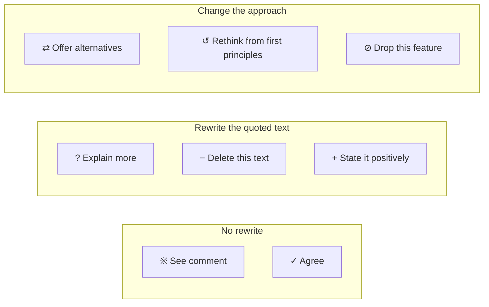
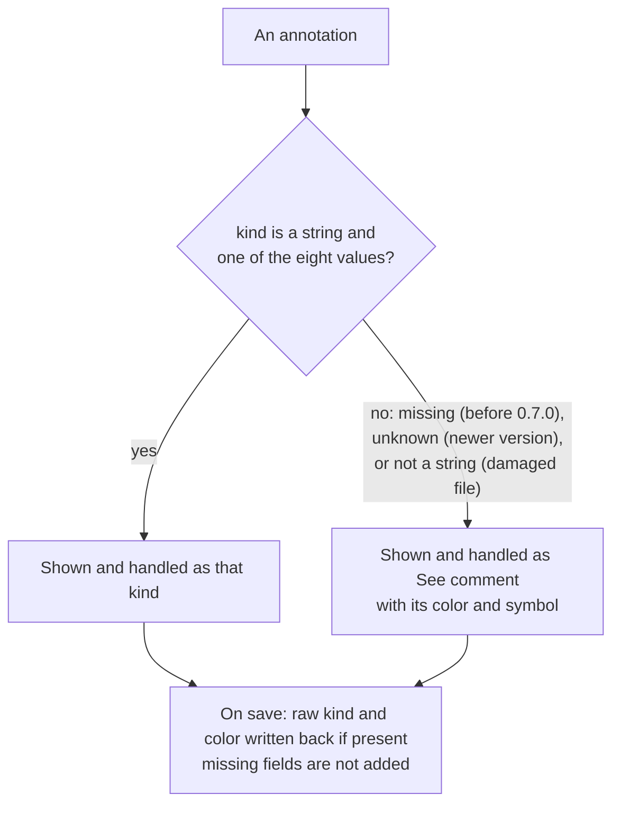

## ADDED Requirements

### Requirement: Fixed set of annotation kinds
The system SHALL support exactly eight annotation kinds, in the order below, each identified by a fixed `kind` value.

| Order | `kind` value | English name | Traditional Chinese name | Symbol |
|---|---|---|---|---|
| 1 | `see-comment` | See comment | 見說明 | ※ |
| 2 | `agree` | Agree | 同意 | ✓ |
| 3 | `explain-more` | Explain more | 請展開解釋 | ? |
| 4 | `offer-alternatives` | Offer alternatives | 提出不同的方式供選擇 | ⇄ |
| 5 | `delete-text` | Delete this text | 刪除這些字 | − |
| 6 | `rethink-first-principles` | Rethink from first principles | 第一性原理重新評估 | ↺ |
| 7 | `state-positively` | State it positively | 不反向列舉 | + |
| 8 | `drop-feature` | Drop this feature | 此功能取消 | ⊘ |

The shared module `reviewer-diff.js` SHALL export `KINDS`, the eight `kind` values
with their symbols in this order, and both the page and the server SHALL use it. The
symbols SHALL be plain text characters, not color emoji. The names SHALL be stored in
the locale files as `kind.<value>.name`, a short hint for reviewers as
`kind.<value>.hint`, and the formal handling text as `kind.<value>.how`, in both `en`
and `zh-Hant` with identical keys. Colors SHALL be defined in CSS.

The kinds fall into three groups by what the reader has to do, which also fixes the
layout of the kind picker:



**Formal handling text.** The locale files' `kind.<value>.how` SHALL be the single
source of how each kind is handled. Every handling text is read together with one
shared lead sentence: 「每則若另有意見，以意見補充的條件為準。」 / "Where an annotation
also has a comment, the conditions in the comment take precedence."

- `see-comment` — 「照意見文字處理。意見可能是修改要求、提問或補充資訊；是提問就先在回覆裡回答，不一定要改文件。」 / "Act on the comment text. It may be a change request, a question or extra information; if it is a question, answer it in your reply first — the document does not always need to change."
- `agree` — 「審閱者認同這段。不要修改，也不必回報。」 / "The reviewer agrees with this passage. Do not change it, and there is no need to report on it."
- `explain-more` — 「這段寫得太簡略，讀者看不懂。在文件裡把這段補寫清楚，說明它是什麼、為什麼、怎麼做；只在回覆裡解釋不算完成。」 / "This passage is too brief for readers to follow. Expand it in the document, explaining what it is, why, and how; explaining it only in your reply does not count as done."
- `offer-alternatives` — 「審閱者不想直接定案。列出 2～3 個可行的做法與各自的取捨，請使用者選；使用者選定之前不要修改文件。」 / "The reviewer does not want this decided yet. List 2–3 workable approaches with their trade-offs and ask the user to choose; do not change the document until the user has chosen."
- `delete-text` — 「刪掉引用的文字（只刪引文，不是整段），再調整前後語句，讓文意通順。」 / "Delete the quoted text (only the quote, not the whole paragraph), then adjust the surrounding sentences so the passage reads smoothly."
- `rethink-first-principles` — 「這個做法的前提可能錯了。回到它要解決的問題重新推導，回報結論；結論跟原做法不同時，才改寫設計並說明理由。」 / "The premise of this approach may be wrong. Go back to the problem it is meant to solve, reason it through again and report your conclusion; only if the conclusion differs from the current approach, rewrite the design and explain why."
- `state-positively` — 「這段用「不做 X、不做 Y」列出反面。改寫成正面描述要做什麼。」 / "This passage lists what not to do (\"no X, no Y\"). Rewrite it to state what to do."
- `drop-feature` — 「這個功能不做了。把它從文件拿掉；同一個變更的其他文件（例如提案、設計、規格）也一併拿掉，只為它存在的段落一起刪。回報拿掉了哪些地方。」 / "This feature is dropped. Remove it from the document, and also from the other documents of the same change (for example the proposal, design and specs), deleting passages that exist only for it. Report where you removed it."

**Short hints** (`kind.<value>.hint`, shown as tooltips on the kind picker and the
card's kind menu):

| `kind` value | zh-Hant hint | English hint |
|---|---|---|
| `see-comment` | 以你寫的意見為準 | Your comment says what to do |
| `agree` | 認同這段，不需處理 | Fine as it is; no action needed |
| `explain-more` | 太簡略、看不懂，請補寫清楚 | Too brief or unclear; expand it |
| `offer-alternatives` | 先列出做法讓你選，不直接改 | List options for you to pick; don't change it yet |
| `delete-text` | 刪掉選取的文字 | Delete the selected text |
| `rethink-first-principles` | 前提可能錯了，從頭推導 | The premise may be wrong; reason it out again |
| `state-positively` | 把「不做什麼」改成「做什麼」 | Turn "don't do X" into "do Y" |
| `drop-feature` | 整個功能拿掉 | Remove the whole feature |

**Colors.** Each kind SHALL have a highlight color and a dot color (used for badges
and dots), with separate values for light and dark mode:

| `kind` value | Highlight (light) | Highlight (dark) | Dot (light) | Dot (dark) |
|---|---|---|---|---|
| `see-comment` | `#fef764` | `#605a00` | `#84663d` | `#fabd38` |
| `agree` | `#d6f7c6` | `#4b5d41` | `#2e8560` | `#78c183` |
| `explain-more` | `#bde3ff` | `#0b3a8c` | `#0762fa` | `#6887a8` |
| `offer-alternatives` | `#c4a5f9` | `#3a1d55` | `#814da5` | `#c196f2` |
| `delete-text` | `#e8a395` | `#3e0e0a` | `#e0094a` | `#db4557` |
| `rethink-first-principles` | `#7ac3c9` | `#12606b` | `#1f6463` | `#08eceb` |
| `state-positively` | `#f8d196` | `#493409` | `#bf3705` | `#d28721` |
| `drop-feature` | `#c3c8c4` | `#3a3c38` | `#6b7391` | `#a2a3a4` |

The symbol inside a badge SHALL be white in light mode and `#0d1117` in dark mode.
With these values, body text over every highlight SHALL have a contrast ratio of at
least 4.5:1 in both modes, every dot SHALL have at least 3:1 against the page and panel
backgrounds, and every badge symbol SHALL have at least 4.5:1 against its dot. A
`mark.anno` element SHALL get the `see-comment` highlight as its base background, so a
highlight whose kind class is missing still uses the theme color and never the
browser's default yellow mark.

The README's "Annotation kinds" section (in both languages) and the external
`md-reviewer` skill (in English) SHALL copy the handling text from the locale files
verbatim. The suggested instruction printed by `md-reviewer --hook` SHALL tell the
agent to act on each annotation whose `status` is `"open"` according to its `kind`,
to treat a missing `kind` as `see-comment`, that `agree` needs no action, and where to
find the kinds' handling in the README.

#### Scenario: Shared kind list
- **WHEN** a test reads `KINDS` from `reviewer-diff.js`
- **THEN** it lists exactly the eight `kind` values above, in the order above, each with its symbol

#### Scenario: Locale entries for every kind
- **WHEN** `locales/en.json` and `locales/zh-Hant.json` are compared
- **THEN** both contain `kind.<value>.name`, `kind.<value>.hint` and `kind.<value>.how` for all eight values, with identical keys

#### Scenario: Dark mode colors
- **WHEN** the page is shown in dark mode
- **THEN** highlights, dots and badges use the dark-mode values above and badge symbols are `#0d1117`

#### Scenario: Highlight without a kind class
- **WHEN** a `mark.anno` element has no recognized kind class
- **THEN** it shows the `see-comment` highlight color of the current theme

#### Scenario: README copies the handling text
- **WHEN** the README's "Annotation kinds" section is compared with the locale files
- **THEN** each kind's handling text in `README.md` equals the `en` `kind.<value>.how` text and in `README.zh-Hant.md` equals the `zh-Hant` text

#### Scenario: Hook instruction mentions kind
- **WHEN** the user runs `md-reviewer --hook`
- **THEN** the printed suggestion tells the agent to handle each open annotation according to its `kind`, to treat a missing `kind` as `see-comment`, and that `agree` needs no action

### Requirement: Kind stored per annotation
Every annotation created by this version SHALL carry a `kind` field holding one of the eight values, and SHALL NOT carry a `color` field.
The `kind` SHALL be written even when the reviewer kept the default, as
`"see-comment"`, so "the reviewer chose See comment" stays distinguishable from "an
older annotation that was never classified". The `comment` field SHALL always be a
string; an empty comment SHALL be stored as `""` and the field SHALL never be omitted.
New annotations SHALL be built with the shared function `newAnnotation(fields)` from
`reviewer-diff.js`. The sidecar's top-level `schema` SHALL stay `1`; `kind` is an
optional field and older sidecars need no conversion.

#### Scenario: Delete this text with an empty comment
- **WHEN** the reviewer selects text, chooses "Delete this text" / 「刪除這些字」, leaves the comment empty and saves
- **THEN** the new annotation in the sidecar has `"kind": "delete-text"` and `"comment": ""`, and has no `color` field

#### Scenario: Default kind is written explicitly
- **WHEN** the reviewer saves an annotation without changing the kind
- **THEN** the annotation has `"kind": "see-comment"`

#### Scenario: Shared constructor
- **WHEN** a test calls `newAnnotation` with any fields
- **THEN** the result has a `kind`, a string `comment`, and no `color`

#### Scenario: Schema unchanged
- **WHEN** a sidecar is saved by this version
- **THEN** its top-level `schema` is `1`

### Requirement: Missing or unknown kind is See comment
An annotation's kind SHALL be resolved with the shared function `kindOf(a)`, which returns `a.kind` when it is a string equal to one of the eight values and `"see-comment"` otherwise.
This covers annotations without `kind` (created before 0.7.0), values this version
does not recognize (for example from a newer version) and values that are not strings
(for example from a hand-edited or badly merged sidecar). Every display and counting
decision — highlight class, badge symbol, kind name, tooltip, the card's kind menu,
the "Copy for Claude" text and the to-do count — SHALL use the value returned by
`kindOf`; the raw `kind` and `color` values from the file SHALL never be placed into
the page as classes, attributes or text. `color` SHALL no longer affect the display:
an older annotation SHALL be shown with the `see-comment` color and symbol whatever
its `color` is.



The resolved kind SHALL NOT be stored on the annotation object in memory, and saving
SHALL write back the raw `kind` and `color` exactly as read, adding neither field when
it was absent. Opening a document SHALL NOT rewrite its sidecar.

#### Scenario: Older annotation with a color
- **WHEN** a sidecar contains an annotation with `"color": "green"` and no `kind`
- **THEN** its highlight, badge, card and tooltip show "See comment" / 「見說明」 with the ※ symbol and the `see-comment` color, not green

#### Scenario: Unknown kind value
- **WHEN** an annotation has `"kind": "nitpick"` and another annotation is then added and saved
- **THEN** the first annotation is shown as See comment and is still saved with `"kind": "nitpick"`

#### Scenario: Kind that is not a string
- **WHEN** an annotation's `kind` is a number, an object or `null`
- **THEN** `kindOf` returns `"see-comment"` and the page renders normally

#### Scenario: Hostile kind value
- **WHEN** an annotation's `kind` is a string containing quotes and HTML such as `x" onmouseover="alert(1)`
- **THEN** the highlight's class is `k-see-comment`, no attribute or markup from the value appears in the page, and nothing runs

#### Scenario: Opening an older sidecar does not rewrite it
- **WHEN** a copy of `DEMO.md` and its `DEMO.review.json` (only `color`, no `kind`) is opened and nothing is changed
- **THEN** the sidecar file is byte-for-byte unchanged

### Requirement: Kind picker in the annotation box
The annotation box SHALL let the reviewer choose one of the eight kinds with native radio buttons, replacing the four color dots.
Each option SHALL be `<label><input type="radio" name="kind"> badge name</label>`,
generated from `KINDS`; the eight options SHALL be wrapped in a `<fieldset>` with a
visually hidden `<legend>` "Kind" / 「分類」. Each option's tooltip SHALL be the kind's
short hint. Names and hints SHALL be marked with `data-i18n` attributes so a language
switch updates them. The options SHALL be laid out in two columns and four rows, in
document order row by row from left to right, so arrow keys move in that order:

| Left column | Right column |
|---|---|
| ※ See comment · Default / 見說明 · 預設 | ✓ Agree / 同意 |
| ? Explain more / 請展開解釋 | ⇄ Offer alternatives / 提出不同的方式供選擇 |
| − Delete this text / 刪除這些字 | ↺ Rethink from first principles / 第一性原理重新評估 |
| + State it positively / 不反向列舉 | ⊘ Drop this feature / 此功能取消 |

"See comment" SHALL be in the first cell, labelled "Default" / 「預設」, and SHALL be
selected every time the annotation box opens, regardless of the previous choice. Long
names SHALL wrap inside their cell.

Only "See comment" SHALL require a comment: saving it with an empty comment SHALL
save nothing and return focus to the comment input. For the other seven kinds an
empty comment SHALL be allowed, and while one of them is selected the input's
placeholder SHALL read "Optional; add details here if you like… (Ctrl+Enter to
save)" / 「可留空；想補充就寫在這裡…（Ctrl+Enter 儲存）」. The save button SHALL read
"Save" / 「儲存」 instead of "Annotate" / 「加註」.

#### Scenario: Default every time
- **WHEN** the reviewer saves an annotation as "Delete this text" and then opens the annotation box for another selection
- **THEN** "See comment" is selected

#### Scenario: See comment needs a comment
- **WHEN** "See comment" is selected, the comment is empty and the reviewer presses "Save"
- **THEN** no annotation is added and focus is in the comment input

#### Scenario: Other kinds may be saved without a comment
- **WHEN** "Agree" is selected, the comment is empty and the reviewer presses Ctrl+Enter
- **THEN** an annotation with `"kind": "agree"` and `"comment": ""` is added

#### Scenario: Placeholder follows the kind
- **WHEN** the reviewer selects "Explain more"
- **THEN** the comment input's placeholder says the comment is optional

#### Scenario: Keyboard selection of a kind
- **WHEN** the reviewer tabs into the kind group and presses Right arrow
- **THEN** focus starts on the selected option and moves to "Agree", which becomes selected

#### Scenario: Language switch updates the picker
- **WHEN** the annotation box is open and the user switches the interface language
- **THEN** the kind names, hints, "Default" label and save button show the new language

### Requirement: Kind is recognizable without color
Every place that shows an annotation's kind SHALL show the kind's symbol together with its color, and SHALL show the kind's name wherever there is room for text, so any two kinds can be told apart without relying on color.

- **Highlights**: each `<mark>` SHALL have the class `anno k-<kindOf(a)>` and a
  `data-sym` attribute holding the symbol from `KINDS` (never from the sidecar). A CSS
  `::before` SHALL draw a small round badge at the start of the highlight, filled with
  the kind's dot color and showing the symbol. Because the badge is generated content,
  it SHALL NOT be selectable, SHALL NOT be copied and SHALL NOT affect quote matching.
  The resolved style (faded with a line-through) SHALL stay as before.
- **Kind picker and the card's kind menu**: the same badge followed by the kind name.
- **Highlight tooltip**: "【<kind name>】<comment>", or "【<kind name>】" when the
  comment is empty. After a language switch the highlights SHALL be re-applied so the
  tooltips show the new language.
- **Cards**: the card's comment line SHALL be omitted when the comment is empty.
- **Whole-block marks**: when a quote cannot be wrapped in a highlight (for example it
  spans bold text, a link or paragraphs) and the block is marked with a line on its
  left instead, the page SHALL record that annotation's id in an id-keyed set in page
  state (`state.blockHl`), not on the annotation. A card whose kind is `delete-text`
  and whose id is in that set SHALL show, under its quote, "Only the quoted text above
  is to be deleted. It can't be marked exactly in the article, so the whole block is
  marked with a line on the left." / 「只刪除上面引用的文字；文章裡無法精確標出，所以整段以左側線條標示」.
  The quote itself SHALL still be shown in full.

Under Chrome DevTools' vision-deficiency emulation (protanopia, deuteranopia,
tritanopia and achromatopsia), any two of the eight kinds SHALL be distinguishable —
by color or by symbol — in the highlights, the kind picker and the cards.

#### Scenario: Badge is not copied
- **WHEN** the user selects and copies text that starts inside a highlight
- **THEN** the copied text does not contain the badge symbol

#### Scenario: Quote matching unaffected
- **WHEN** a document with highlights is reloaded
- **THEN** every highlight wraps exactly its quote, as without badges

#### Scenario: Tooltip with an empty comment
- **WHEN** the user hovers over a "Delete this text" highlight whose comment is empty
- **THEN** the tooltip reads "【Delete this text】" / 「【刪除這些字】」

#### Scenario: Tooltip follows the language
- **WHEN** the user switches the interface language while a document with annotations is open
- **THEN** hovering a highlight shows the kind name in the new language

#### Scenario: Delete this text on a whole-block mark
- **WHEN** a "Delete this text" annotation's quote spans a link, so its block is marked with a left line
- **THEN** its card shows the note that only the quoted text is to be deleted, and the annotation object has no new field

#### Scenario: Achromatopsia emulation
- **WHEN** the eight kinds are shown side by side under achromatopsia emulation
- **THEN** each kind can still be identified by its badge symbol and, on cards and in the picker, its name

### Requirement: Kind can be changed on the card
Each annotation card SHALL show, on its top line, the kind badge, a native `<select>` listing the eight kind names, and the line number, with the select's value set to `kindOf(a)`.
The select's tooltip SHALL be the current kind's short hint. Choosing another kind
SHALL change only that annotation's `kind` field; its comment, status, quote, line,
`color` and every other field SHALL stay unchanged. The highlight and the card SHALL
then be redrawn and the change autosaved. Changing a kind SHALL NOT affect the
document's review-complete record, just like "Reopen". The card's delete button SHALL
read "Delete annotation" / 「刪除註解」 instead of "Delete" / 「刪除」, so it is not
confused with the "Delete this text" kind.

#### Scenario: Change the kind of an annotation
- **WHEN** the user changes a card's kind from "See comment" to "Explain more"
- **THEN** the sidecar's annotation has `"kind": "explain-more"` with the same comment and status, and the highlight shows the `explain-more` color and ? symbol

#### Scenario: Older annotation keeps its color field
- **WHEN** the user changes an older annotation (with `color`, without `kind`) to "Agree"
- **THEN** the saved annotation has `"kind": "agree"` and still has its original `color`

#### Scenario: Review record is kept
- **WHEN** the document is marked review complete and the user changes an annotation's kind
- **THEN** the sidecar still contains the same `review` field and no notice about clearing completion is shown

#### Scenario: Delete button label
- **WHEN** a card is shown
- **THEN** its delete button reads "Delete annotation" / 「刪除註解」

### Requirement: Copy for Claude carries kinds
The "📋 Copy for Claude" text SHALL label every annotation with its kind name, placed after the line number and before the quote, and SHALL explain the kinds it uses.
The text SHALL be built as follows:

1. The existing header and summary line; the summary's open count SHALL be the number
   of to-do annotations (see "Agree annotations are not to-dos").
2. A kind explanation section, headed 「分類說明（每則若另有意見，以意見補充的條件為準）：」 /
   "How to handle each kind (where an annotation also has a comment, the conditions in
   the comment take precedence):", with one line `- <kind name>：<handling text>` for
   each kind used by the numbered items, in the order each kind first appears among
   them. The text SHALL come from the locale's `kind.<value>.how` in the interface
   language. The section SHALL be omitted when every numbered item is "See comment" or
   there are no numbered items.
3. The numbered items: every to-do annotation, sorted by line, each as
   `[<n>] L<line>【<kind name>】「<quote>」<match-state marker>` followed by a line
   `→ <comment>`; the `→` line SHALL be omitted when the comment is empty. The first
   line of each item SHALL still end with the match-state marker required by
   `annotation-revision-diff`.
4. When there are unresolved "Agree" annotations, an unnumbered section titled
   「（同意，不必處理）」 / "(agree — no action needed)", with one line
   `- L<line>「<quote>」<match-state marker>→ <comment>` each.
5. The resolved section as before, with each line
   `- L<line>【<kind name>】「<quote>」<match-state marker>→ <comment>`.

In list lines (steps 4 and 5), the `→ <comment>` part SHALL be omitted when the
comment is empty.

Example (Traditional Chinese interface, handling texts shortened here):

```text
# 審閱回饋：design.md
共 6 則（未解決 4）

分類說明（每則若另有意見，以意見補充的條件為準）：
- 請展開解釋：這段寫得太簡略，讀者看不懂。在文件裡把這段補寫清楚……
- 刪除這些字：刪掉引用的文字（只刪引文，不是整段），再調整前後語句……
- 第一性原理重新評估：這個做法的前提可能錯了。回到它要解決的問題重新推導……
- 見說明：照意見文字處理。意見可能是修改要求、提問或補充資訊……

[1] L12【請展開解釋】「API 逾時設 30 秒」
→ 為什麼是 30 秒？

[2] L40【刪除這些字】「沿用舊版快取」（原文已修改）

[3] L57【第一性原理重新評估】「先把所有檔案載入記憶體再比對」

[4] L70【見說明】「術語表」
→ 加上英文對照

（同意，不必處理）
- L63「三段式流程圖」→ 這張圖很清楚

（已解決）
- L5【見說明】「標題」→ 改短一點
```

#### Scenario: Mixed kinds
- **WHEN** the user copies annotations matching the example above
- **THEN** the copied text has the structure of the example: the summary counts 4 open, the explanation section lists the four kinds used in first-appearance order, and the Agree annotation is in its own unnumbered section

#### Scenario: Only See comment items
- **WHEN** every numbered item is "See comment"
- **THEN** the copied text has no kind explanation section, and each item is still labelled 【見說明】 / 【See comment】

#### Scenario: Empty comment
- **WHEN** a numbered "Delete this text" annotation has an empty comment
- **THEN** its item is only the first line, with no `→` line

#### Scenario: Match-state marker stays at the end
- **WHEN** a numbered item's original text has changed since it was annotated
- **THEN** the item's first line ends with the "original text changed" marker after the quote

#### Scenario: Explanation follows the interface language
- **WHEN** the interface language is English and the user copies annotations with several kinds
- **THEN** the explanation section uses the English names and the English handling text

### Requirement: Agree annotations are not to-dos
An annotation SHALL count as a to-do only when its `status` is not `"resolved"` and `kindOf(a)` is not `"agree"`, as computed by the shared function `isTodo(a)`.
Older annotations without `kind` resolve to `see-comment` and therefore count as
to-dos. Every "unresolved" count SHALL equal the number of to-dos and SHALL be computed
with `isTodo`: the left-list badge (the server's `annCounts`, so every list section
including Favorites), the confirmation before marking a review complete, and the
summary line of "Copy for Claude". Adding an "Agree" annotation to a document marked
review complete SHALL NOT remove the review-complete record and SHALL NOT show the
notice; adding an annotation of any other kind SHALL remove it and notify once, as
before. An "Agree" annotation SHALL keep `status: "open"` and stay on its card until
the user resolves it.

#### Scenario: Badge ignores Agree
- **WHEN** a document has one unresolved "See comment", two unresolved "Agree" and one resolved annotation
- **THEN** its left-list badge shows 1

#### Scenario: Shared to-do rule
- **WHEN** a test calls `isTodo`
- **THEN** it returns false for an unresolved "Agree", true for an unresolved "See comment" and for an older annotation without `kind`, and false for any resolved annotation

#### Scenario: Agree on a completed document
- **WHEN** the document is marked review complete and the user adds an "Agree" annotation
- **THEN** the `review` field is still in the sidecar and no completion-cleared notice is shown

#### Scenario: Agree stays on its card
- **WHEN** the user adds an "Agree" annotation
- **THEN** it is saved with `"status": "open"` and its card stays in the panel until the user presses "Resolve" / 「標記解決」

---
🤖 claude-opus-5-5[1m] · effort: ? · 2026-10-08
