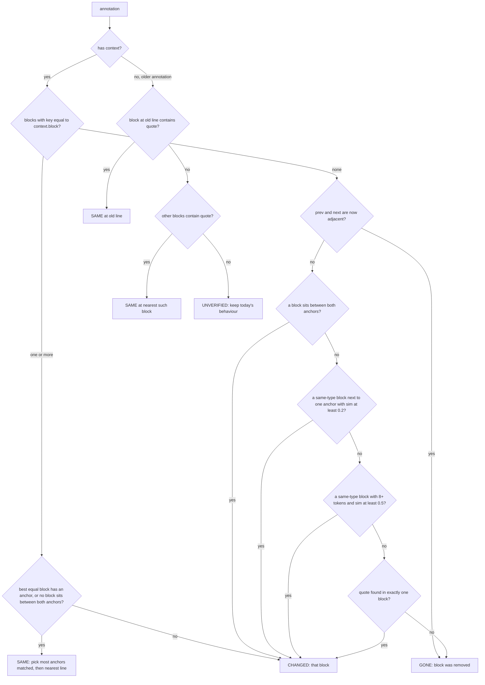
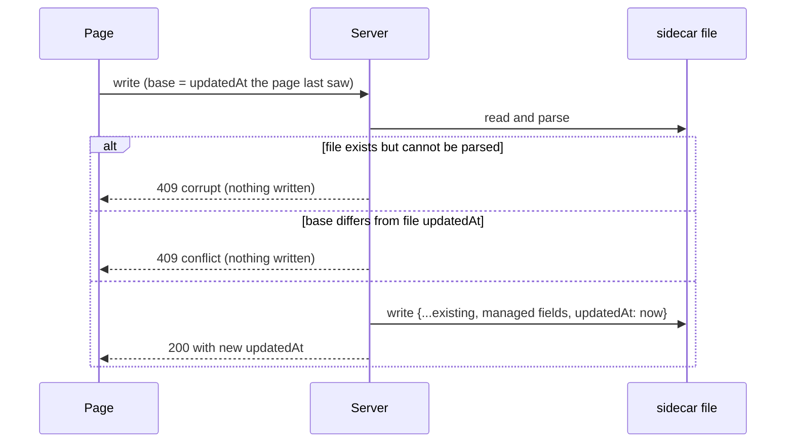
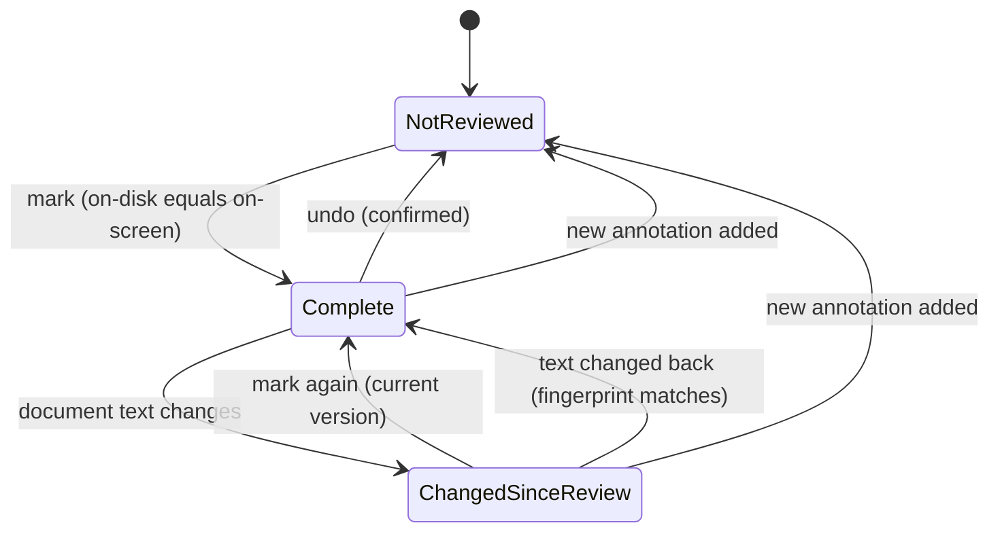

## Context

How the reviewer works today (from the code):

- `server.cjs` serves the page and a token-protected JSON API on `127.0.0.1`.
  - `GET /api/file` returns the `.md` text plus the annotations read from the
    sidecar `<base>.review.json`.
  - `POST /api/save` rewrites the whole sidecar from the annotations the browser
    sends. It filters nothing: the browser sends the in-memory `state.annotations`
    objects as they are.
  - If the sidecar cannot be parsed, both `/api/file` and `annCounts` swallow the
    error and report zero annotations. The next save then overwrites the file.
- The server makes a new token on every start, so a tab from an older server run
  gets 403 on every write. Old front-end code never talks to a new server.
- Sidecar today: `{ file, schema: 1, updatedAt, annotations: [ { id, line, quote,
  comment, color, status, createdAt } ] }`.
- `reviewer.js` renders Markdown itself. Most block elements carry
  `data-line="<n>"`, the 1-based source line where the block starts: p, h1–h6,
  li, table, pre, blockquote, hr, and the mermaid div. Details that matter here:
  - A blockquote and its first child share the same `data-line`.
  - A parent `li` contains its child list in the DOM.
  - Text after an HTML comment on the same line (`<!-- x --> text`) is inserted
    as an extra array element, so every later `data-line` is off by one. This is
    an existing bug.
- Highlights are placed by finding `[data-line=a.line]` and the first text node
  inside it containing `a.quote`. If the quote is not found, the whole block is
  marked. If no element has that line, nothing is marked and "Go to" does
  nothing.
- `/api/sidebar` rows carry `annCounts` (total/open) read from each sidecar. The
  browser polls it every 4 seconds.
- `~/.md-reviewer/` holds history, favorites and pins, keyed by absolute path.

## Goals / Non-Goals

**Goals:**
- A per-document "review complete" record (latest state only) that survives
  restarts and travels with the document between machines.
- Detect when a completed document has changed since it was approved.
- In each annotation card, show what the annotated paragraph used to say and what
  it says now, and do not show a misleading difference when unsure.
- Never lose sidecar data because of a merge conflict or a stale tab.
- A back-to-top control for long documents.
- Stay zero-dependency, no build step, backward compatible with existing sidecars.

**Non-Goals:**
- Syncing `~/.md-reviewer/` across machines.
- A history of review rounds, who reviewed, or an overview screen.
- Live re-rendering of the open document.
- Rendering the difference as formatted Markdown (it is a difference of source).
- Merging two diverged sidecars automatically.

## Decisions

### D1. The review record lives in the sidecar

```json
{
  "file": "DEMO.md", "schema": 1, "updatedAt": "…",
  "review": { "status": "done", "at": "2026-10-08T06:00:00.000Z", "hash": "<64 hex>" },
  "annotations": [ … ]
}
```

- `review` is absent when the document is not marked complete.
- Displayed state is derived, never stored:
  - no `review` → **not reviewed**;
  - `review.hash` equals the fingerprint of the document being compared →
    **complete**;
  - otherwise → **changed since review**.
- Why the sidecar: it is already the per-document store, the AI already reads it,
  and it moves with the document through git or a synced folder. This is what
  makes the record cross-device without any new mechanism.
- Rejected: `~/.md-reviewer/reviews.json` keyed by absolute path. It would be
  per-machine (`D:\work\x.md` vs `/Users/a/work/x.md`).
- Rejected: a configurable data directory pointed at a cloud folder. The keys are
  still absolute paths, so the same problem.

### D2. One text normalization, one fingerprint, both computed in shared code

- `normText(s)`, defined once in `reviewer-diff.js` and used by the server and the
  browser:
  1. remove a leading BOM;
  2. convert CRLF and CR to LF;
  3. remove trailing spaces and tabs from every line.
- `hashOf(s)` (server) = SHA-256 hex of `normText(s)`. The normalization keeps
  Windows and macOS checkouts of the same commit equal (git `autocrlf`), and
  editors that strip trailing spaces do not flip a document to "changed".
- The browser slices block source from `normText(content)`, so stored `context`
  and the blocks it is compared against are normalized the same way.
- The server caches fingerprints per path by `mtimeMs` + `size`, so the 4-second
  poll does not re-read and re-hash unchanged files.

### D3. Writing the review record: a dedicated endpoint

- `POST /api/review { path, token, done, hash, base }`:
  - `done: true`: `hash` must be 64 hex characters **and** equal the current
    on-disk fingerprint; otherwise the server returns 409 `stale` ("the file on
    disk is newer than the one you read, reload first"). On success it writes
    `review = { status: "done", at: now, hash }`.
  - `done: false`: the server deletes `review`.
  - Both go through the same guarded write as `/api/save` (D8): read the existing
    sidecar, refuse if unreadable or if `base` ≠ its `updatedAt`, keep every other
    field, set a new `updatedAt`. The response returns the new `updatedAt` and
    `review`.
- `/api/save` never touches `review`; it only replaces `annotations`. This avoids
  the "an annotation save without `review` wipes the record" trap.
- Rejected: carrying `review` inside `/api/save`. Every save would have to echo
  the record back, and a single omission would delete it.

### D4. Review rules in the front end

- Toolbar button `#btnDone`. Its label says what clicking will do:

  | State | Label | Click |
  |---|---|---|
  | Not reviewed | ☐ Mark review complete | mark |
  | Complete | ✅ Review complete | confirm, then remove the record |
  | Changed since review | ⚠ Changed since review · mark again | mark with the current version |

  The tooltip shows the completion time in local time.
- Marking while annotations are unresolved asks "N annotations are still
  unresolved. Mark complete anyway?".
- A successful mark also removes the document from "📥 To review" (existing
  `/api/dequeue`).
- Adding a new annotation to a completed document removes the record (a new
  comment means the review is open again). The notice bar says so once.
- Left list rows get a small pill: **Reviewed** (green) or **Changed** (amber),
  with the time in the tooltip. It is a pill with text so it cannot be confused
  with the existing "✓ remove from To review" control.
- All server writes from the page go through one promise chain, so a review write
  and a debounced annotation save never race each other on `base`.

### D5. Block ranges come from the renderer

- `renderMarkdown` writes `data-end="<n>"` next to `data-line` on every block: the
  last source line the block consumed. The renderer already knows it (the loop
  index after the block). For list items, it is the item line plus its
  continuation lines, not its sub-items. When mermaid rendering fails and falls
  back to a `<pre>`, both attributes are copied.
- The HTML-comment bug is fixed in place: the tail text replaces the comment's
  last line (`lines[j] = after; i = j`) instead of inserting a new line, so line
  numbers no longer drift.
- `buildBlocks()` in `reviewer.js` turns the rendered DOM into a list
  `[{ line, end, src, text }]`, ordered by line:
  - one entry per distinct `data-line`; when several elements share a line
    (blockquote and its first child), it keeps the innermost one (smallest
    `end`);
  - `src` = lines `line..end` of `normText(content)`;
  - `text` = the element's own visible text, without nested `[data-line]`
    elements, with a space after each table cell, and whitespace collapsed.
- The same `buildBlocks()` result is used when an annotation is created and when
  a document is opened, so "exactly equal" comparisons are meaningful.

### D6. What an annotation stores (`context`)

```json
"context": { "block": "<src of the block>", "prev": "<first line of previous block or null>", "next": "<first line of next block or null>" }
```

- Captured when the annotation is saved, from the block under the selection
  (innermost `[data-line]`). An empty `block` is never stored.
- `prev` and `next` are short anchors. They let the matcher tell **removed** from
  **rewritten**, and pick the right copy of a repeated block.
- For a large table or code block, `block` is the whole block. This is accepted:
  the AI reads the sidecar, and the extra text is relevant.
- `context` is never updated after creation; it always means "the text when this
  comment was written". Long-running annotations therefore keep showing the full
  difference since they were written.

### D7. Matching annotations to the current document (`reanchor`)

`reanchor(annotations, blocks)` in `reviewer-diff.js` is a pure function. It
returns a `Map` from annotation id to `{ state, line, src, quoteKept }`.

Helper functions:
- `key(s)`: whitespace collapsed, trimmed, and a leading ordered-list number
  replaced by `#.`. Renumbering a list or re-wrapping a paragraph does not count
  as a change.
- `first(b)`: `key` of the block's first line.
- `nb(i)`: how many of the stored anchors match around block `i`, 0–2. A `null`
  anchor matches the start or end of the document.
- `sim(a, b)`: Dice coefficient on **token** bigrams. Tokens are Latin
  word-or-number runs, or any other single code point (so each Chinese character
  is one token, and emoji are not split). Whitespace, punctuation and symbol
  tokens are dropped, which removes Markdown markers such as `#`, `-`, `|`, `*`.
  If either side has fewer than 2 tokens, the result is 1 when the keys are
  equal, else 0 (no NaN).
- `type(src)`: heading, list item, table, code, quote, rule, or paragraph, from
  the first line, using the same patterns as the renderer.



- **Repeated blocks**: an exact copy elsewhere does not win over the annotated
  position. If the best equal block has no matching anchor, and some other block
  sits exactly between both anchors, the annotated copy was edited. The result is
  CHANGED at that block, not SAME on the untouched copy.
- **Short blocks** (fewer than 8 tokens, for example `## Summary` or `- Yes`)
  are never matched by global similarity (step H). Only exact match, the anchor
  slots, or the quote can place them. This is what stops "`## 結論` → `## 背景`".
- Among candidates with the same score, the nearest to the old line wins:
  score − `0.1 × |Δline| / max(totalLines, 1)`, capped at 0.1. This only breaks
  near-ties. The thresholds are compared against the raw similarity.
- Block bigrams are computed once per `reanchor` call, not once per pair.
- `quoteKept`: for CHANGED, whether the normalized quote still appears in the
  new block's text. The card then says "your quoted text is still there", which
  explains a difference elsewhere in a shared table or paragraph.
- **Older annotations (no `context`)**:
  - SAME at the old line or at the nearest block containing the quote.
  - `context` is filled in **only** when the quote has at least 4 tokens and
    appears in exactly one block. With several matches, the line moves for
    display but nothing is filled in.
  - UNVERIFIED keeps today's behaviour: whole-block mark at the old line if an
    element is there, "Go to" works. The card says "original may have changed
    (older annotation, can't compare)".
- **Effects**:
  - SAME and CHANGED set `a.line` to the matched block's line.
  - GONE keeps `a.line` but is not highlighted. Its card hides "Go to" and shows
    "was L42".
  - Opening a document never writes the sidecar. The corrected `line` and any
    filled-in `context` are written the next time the user changes an
    annotation.
- `renderDoc` runs in this order, synchronously:
  1. set `innerHTML`;
  2. `buildBlocks()`;
  3. `reanchor`;
  4. `applyHighlights` (skipping GONE);
  5. `renderMermaid`.

  Mermaid replaces its source with SVG only after an `await`, so the blocks
  still see the source.

### D8. Guarded sidecar writes (shared by `/api/save` and `/api/review`)



- `/api/file` reports `sidecarError` when the file exists but cannot be parsed.
  The page shows a persistent notice and does not attempt to save.
- "Missing file" and "no `updatedAt`" both count as `base = null`.
- Unknown top-level fields and unknown annotation fields written by a newer
  version are kept. The browser sends annotations through one field whitelist
  (`buildSidecar`, also used by "⬇ Export"), so values computed in memory can
  never leak into the file.
- On 409 the page shows "changed elsewhere, reload" and stops autosaving until
  reloaded. Unsaved edits stay on screen, so the user can copy them if needed.

### D9. Noticing changes on disk

- `GET /api/sidebar?current=<open path>` also returns
  `current: { hash, updatedAt }` for the open document.
- The page compares these with what it loaded:
  - a different `hash` means the document changed on disk: "This document
    changed on disk — ↻ Reload to see changes";
  - a different `updatedAt` means the annotations changed elsewhere.

  The check is skipped while a write is in flight or pending, so the page's own
  saves never trigger it.
- No auto-reload: reloading moves the scroll position and could drop an unsaved
  comment being typed.

### D10. The difference shown in a card

- `textDiff(old, new)` works in two levels with one LCS helper:
  1. by line, comparing `key(line)` so whitespace-only line changes are equal;
  2. for each run of changed lines, by token (Latin runs, whitespace runs, single
     code points, using the `u` flag), with all whitespace tokens equal.
- Within each changed run, all removals come before all additions, so the output
  never reads `+a −b +c −d`.
- Size cap: an LCS table larger than 250,000 cells (one-dimensional
  `Uint16Array`) falls back to "removed all / added all" for that run only.
  Line-level splitting keeps normal tables and code blocks far below the cap.
- Rendering:
  - removals are `<del>` (struck through, red tint) and additions are `<ins>`
    (green tint);
  - unchanged stretches longer than 60 characters are shortened to the first and
    last 20 characters around "…";
  - the box has a max height and scrolls.
- Cards of unresolved annotations show the difference open. Resolved cards show
  it inside a closed `<details>` ("Show changes"). Difference results are
  computed once per document open and cached by annotation id.
- "📋 Copy for Claude" appends "(original text changed)", "(paragraph removed)"
  or "(original may have changed)" to the matching lines, and uses the corrected
  line numbers.

### D11. Back-to-top button

- A `<button id="toTop">` placed as the last child of the scrolling `#doc`, after
  `#docInner`, so `renderDoc` never removes it. CSS:
  - `position: sticky; bottom: 0; display: block; margin-left: auto` keeps it in
    the bottom-right of the reading pane with either side panel collapsed;
  - `z-index` above the mermaid zoom button.
- It is shown with `visibility`/`opacity`, not `display`, so the scroll height
  never jumps. It appears when `#doc.scrollTop` exceeds one pane height.
- Click → `#doc.scrollTo({ top: 0, behavior: "smooth" })`. The `#doc` mouseup
  handler ignores clicks on it, so an active text selection does not open the
  annotation popover.
- Title and `aria-label` come from i18n.

### D12. Where the new code goes

- `reviewer-diff.js` (new; loaded in the browser and by the server). The whole
  file is wrapped in an IIFE that exposes one global, `window.MDRDiff`, and sets
  `module.exports` under Node, so its names cannot collide with `reviewer.js`'s
  top-level names. It contains `normText`, `key`, `sim`, `textDiff`, `reanchor`.
- `server.cjs`:
  - `require("./reviewer-diff.js")` for `normText`;
  - `hashOf` with the stat cache;
  - `readSidecar` (missing, ok, or unreadable);
  - a guarded `writeSidecar`;
  - `/api/review`;
  - extended `/api/file`, `/api/save`, `/api/sidebar` and `annCounts`;
  - the static route adds `/reviewer-diff.js`.
- `reviewer.js`:
  - `renderMarkdown` and `renderList` emit `data-end`, plus the comment fix;
  - the mermaid fallback copies `data-end`;
  - new `buildBlocks`;
  - `renderDoc` order (D7);
  - mouseup and `saveAnnotation` capture `context`;
  - `applyHighlights` and `gotoAnno` skip GONE;
  - `renderSide` adds the difference box and state labels;
  - `buildSidecar` gets the field whitelist, and `saveToServer` uses it plus
    `base`;
  - the review button, the notice bar, the write chain, list pills, the Copy
    labels, and back-to-top.
- `reviewer.html`: script tag for `reviewer-diff.js` before `reviewer.js`,
  `#btnDone`, `#notice`, `#toTop`. `applyLocale` also fills `[data-i18n-aria]`.
- `locales/en.json`, `locales/zh-Hant.json`: same new keys in both.
- `test/diff.test.cjs`: plain `assert` checks for `normText`, `sim` edge cases,
  `textDiff`, and the `reanchor` cases below. Run with `npm test`.

## Review status at a glance



## Test cases for `reanchor` (must pass in `test/diff.test.cjs`)

| Situation | Expected |
|---|---|
| Paragraph unchanged, 30 lines inserted above | SAME, line follows |
| One word changed in the paragraph | CHANGED, difference shows only that word |
| Paragraph re-wrapped to different line breaks, no word change | SAME |
| Ordered list renumbered (`3.` → `4.`) | SAME |
| List item `- Support macOS` deleted between Windows and Linux | GONE (not "macOS → Linux") |
| `## Summary` renamed to `## Overview`, neighbours unchanged | CHANGED |
| `## Summary` deleted, other headings exist | GONE |
| Same paragraph appears twice, the annotated copy edited | CHANGED on the edited copy (anchors decide) |
| Same heading appears twice, 90 lines inserted between | SAME on the annotated copy (anchors decide) |
| Older annotation, quote still in its block | SAME, `context` filled in only if the quote is unique and ≥ 4 tokens |
| Older annotation, quote nowhere | UNVERIFIED |
| CRLF context vs LF document | SAME |
| Empty strings / one-token strings in `sim` | no NaN |

## Risks / Trade-offs

- **Sidecars excluded from git** → no cross-device record. Mitigation: the README
  Cross-device section, including `git check-ignore -v`.
- **Two machines change the same sidecar** → a git conflict, or a synced-drive
  "conflicted copy". The guarded write (D8) makes sure the page never overwrites a
  conflicted file. Merging stays manual: combine both `annotations` arrays and
  keep either `updatedAt`. Documented.
- **A device still on 0.5.x** rewrites the sidecar from fixed fields and drops
  `review`. Its front end sends annotation objects unchanged, so `context`
  survives. Mitigation: the README says every device must run ≥ 0.6.0.
- **Matching can still be wrong** after heavy rewrites of a whole section, where
  both anchors changed too. Mitigation: strict thresholds, short blocks excluded,
  and the card always shows the old text, so a wrong match is visible.
- **A paragraph split in two** matches one half. The other half shows as removed
  although it moved to the next paragraph. Accepted; the card still shows the
  full old text.
- **Large code-block `context`** makes the sidecar bigger. Accepted (D6).
- **The difference is of Markdown source**, so `**`, `|`, `-` appear in it.
  Accepted: the users write Markdown, and it is exactly what changed.

## Migration Plan

No data migration. Old sidecars load unchanged: new fields are optional,
`schema` stays `1`, and older annotations take the conservative path (D7).
Rolling a device back to 0.5.x keeps annotations, but its next save drops
`review` (see Risks). The CHANGELOG says this, and also that old/new
differences are only available for annotations created with 0.6.0 or later
(or older ones whose context could be filled in).

## Open Questions

- None blocking. The similarity thresholds (0.2 slot, 0.5 global, 8-token
  minimum) are named constants and may be tuned after real use.

---
🤖 claude-opus-5-5[1m] · effort: xhigh · 2026-10-08
