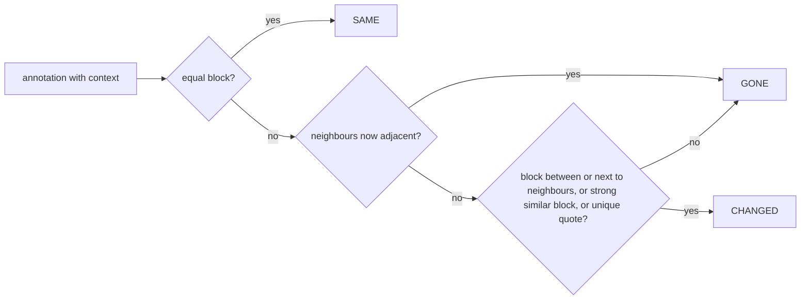

# annotation-revision-diff Specification

## Purpose
Keep annotations attached to the right paragraph after the document is revised, and show the reviewer what the annotated paragraph used to say and what it says now, without showing a misleading difference when unsure.
## Requirements
### Requirement: Accurate block source ranges
Every rendered block element SHALL carry `data-line` (first source line) and
`data-end` (last source line it consumed). For a list item, `data-end` SHALL cover
the item line and its continuation lines but not its sub-items. Text that follows
an HTML comment on the same line SHALL NOT shift the line numbers of later blocks.

#### Scenario: Comment followed by text
- **WHEN** a document has `<!-- note --> tail` on line 2 and a heading on line 4
- **THEN** the heading element has `data-line="4"`

#### Scenario: Nested list item
- **WHEN** a list item on line 4 has a sub-item on line 5
- **THEN** the outer item has `data-line="4"` and `data-end="4"`

### Requirement: Annotation stores its block context
When an annotation is created, the system SHALL store `context` with `block` (the
normalized Markdown source of the innermost block under the selection), `prev` (the
first line of the previous block, or null at the start), and `next` (the first line
of the next block, or null at the end). An empty `block` SHALL NOT be stored.
`context` SHALL NOT change after creation.

#### Scenario: New annotation in a paragraph
- **WHEN** the user annotates text in a two-line paragraph between a heading and a list
- **THEN** the saved annotation's `context.block` is the two lines, `prev` is the heading line, and `next` is the first list line

### Requirement: Annotations are matched to the current document on open
When a document is opened, the system SHALL classify each annotation that has a
`context` as SAME, CHANGED or GONE, and SHALL move its line to the matched block for
SAME and CHANGED. Whitespace-only differences and ordered-list renumbering SHALL
count as SAME. A block between the stored neighbours that are now adjacent SHALL be
classified GONE. Blocks with fewer than 8 tokens SHALL NOT be matched by similarity
to unrelated places in the document.

#### Scenario: Paragraph moved down
- **WHEN** 30 lines are inserted above an unchanged annotated paragraph
- **THEN** the annotation is SAME and its highlight is on the moved paragraph

#### Scenario: One word changed
- **WHEN** one word in the annotated paragraph is changed
- **THEN** the annotation is CHANGED and points at the edited paragraph

#### Scenario: List item deleted
- **WHEN** the annotated item "- Support macOS" is deleted from between "- Support Windows" and "- Support Linux"
- **THEN** the annotation is GONE and is not shown as changed into the Linux item

#### Scenario: Renamed heading
- **WHEN** the annotated heading `## Summary` becomes `## Overview` and its neighbours are unchanged
- **THEN** the annotation is CHANGED

#### Scenario: Edited copy of a repeated paragraph
- **WHEN** a paragraph appears twice and only the annotated copy is edited
- **THEN** the annotation is CHANGED on the edited copy, not SAME on the untouched copy

### Requirement: Older annotations are handled conservatively
For an annotation without `context`, the system SHALL locate the block containing
its quote (preferring the block at its stored line, then the nearest). If no block
contains the quote, the annotation SHALL be classified UNVERIFIED and keep the
previous behaviour (whole-block mark at its stored line when an element exists
there, "Go to" works). A `context` SHALL be filled in only when the quote has at
least 4 tokens and appears in exactly one block.

#### Scenario: Quote not found
- **WHEN** an older annotation's quote no longer appears anywhere
- **THEN** the card is labelled "original may have changed (older annotation, can't compare)" and "Go to" still works

#### Scenario: Ambiguous quote
- **WHEN** an older annotation's quote appears in three blocks
- **THEN** no `context` is filled in

### Requirement: Opening a document never writes the sidecar
Matching on open SHALL NOT write the sidecar. Corrected line numbers and filled-in
`context` SHALL be persisted only when the user next changes an annotation.

#### Scenario: Open and close without edits
- **WHEN** a document whose annotations moved is opened and closed without any annotation change
- **THEN** the sidecar file is byte-for-byte unchanged

### Requirement: Old/new difference in the annotation card
For a CHANGED annotation the card SHALL show "Original text changed" and a
difference between `context.block` and the matched block, computed by line and then
by word (each CJK character is one token), with removed text struck through and
added text highlighted, and with whitespace-only changes ignored. Cards of resolved
annotations SHALL show the difference collapsed behind "Show changes". When the
quote is still present in the new block, the card SHALL say so.

#### Scenario: Unresolved card
- **WHEN** an unresolved annotation is CHANGED
- **THEN** its card shows the difference expanded, with the removed and added words marked

#### Scenario: Resolved card
- **WHEN** a resolved annotation is CHANGED and "Show resolved" is on
- **THEN** its card shows a collapsed "Show changes" control

### Requirement: Gone annotations are shown honestly
A GONE annotation SHALL NOT be highlighted in the document, its card SHALL hide
"Go to", show its stored line as "was L<n>", and show the old block text with the
label "paragraph removed or rewritten beyond recognition".

#### Scenario: Gone card
- **WHEN** the annotated paragraph has been deleted
- **THEN** no highlight appears for it and its card shows the old text and "was L<n>"

### Requirement: Copy for Claude carries the match state
The "Copy for Claude" text SHALL use each annotation's current line and SHALL append
a marker for CHANGED ("original text changed"), GONE ("paragraph removed") and
UNVERIFIED ("original may have changed") annotations.

#### Scenario: Copy with a changed annotation
- **WHEN** the user copies annotations and one of them is CHANGED
- **THEN** that line of the copied text ends with the "original text changed" marker

### Requirement: Notice when the open document changes on disk
While a document is open, the page SHALL detect within one sidebar poll that the
file's fingerprint or its sidecar's `updatedAt` differs from what the page loaded,
SHALL show a notice with a reload button, and SHALL NOT reload automatically. The
page's own writes SHALL NOT trigger the notice.

#### Scenario: AI revises the open document
- **WHEN** the open document is rewritten on disk by another program
- **THEN** within a few seconds the page shows "This document changed on disk" with a reload button

---
🤖 claude-opus-5-5[1m] · effort: xhigh · 2026-10-08

