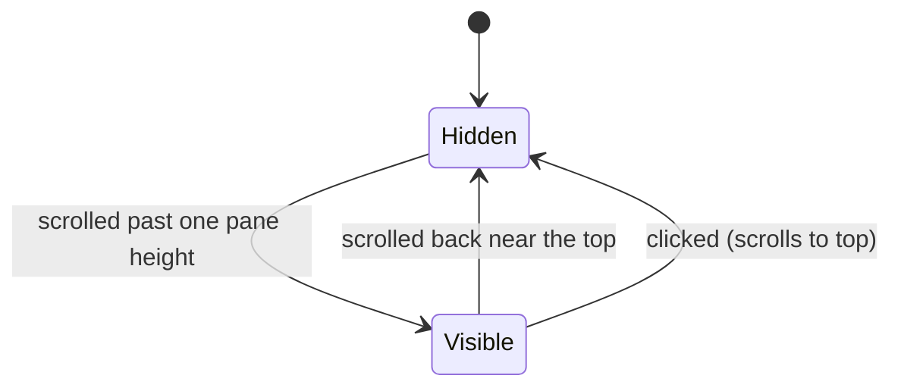

# back-to-top Specification

## Purpose
Give readers of long documents a one-click way back to the top of the reading pane, without disturbing selection, annotation, or layout.
## Requirements
### Requirement: Back-to-top button in the reading pane
The reading pane SHALL contain a back-to-top button in its bottom-right corner that
is hidden until the document has been scrolled down more than one pane height, and
that scrolls the document smoothly to the top when clicked. Showing and hiding SHALL
NOT change the document's scroll height. Its title and accessible name SHALL come
from the active locale.

#### Scenario: Appears after scrolling
- **WHEN** the user scrolls a long document down by more than one pane height
- **THEN** the back-to-top button becomes visible in the bottom-right of the reading pane

#### Scenario: Returns to the top
- **WHEN** the user clicks the visible button
- **THEN** the document scrolls to the top and the button hides

#### Scenario: Works with side panels collapsed
- **WHEN** the left and right panels are collapsed
- **THEN** the button is still in the bottom-right corner of the reading pane

#### Scenario: Does not open the annotation popover
- **WHEN** text is selected in the document and the user clicks the button
- **THEN** the annotation popover does not open

---
🤖 claude-opus-5-5[1m] · effort: xhigh · 2026-10-08

