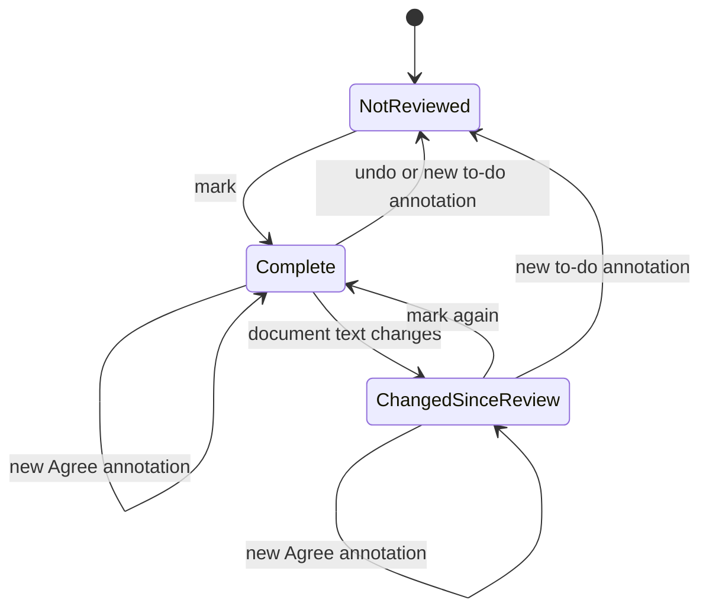

# review-status Specification

## Purpose
Record, per document, whether its review is complete, and detect when a completed document has changed since. The record lives in the document's sidecar so it is persistent and travels with the document between machines.
## Requirements
### Requirement: Review-complete record stored in the sidecar
The system SHALL store a document's review-complete record only in that document's
sidecar (`<base>.review.json`), as a top-level `review` object
`{ "status": "done", "at": <ISO time>, "hash": <64-char hex fingerprint> }`. The
field SHALL be absent when the document is not marked complete. No copy of the
record SHALL be kept in `~/.md-reviewer/`, so the record moves with the document
wherever the sidecar is synced or committed. Only a new to-do annotation (any kind
except "Agree", as defined by `annotation-kinds`) changes a complete or changed
document back to not reviewed; a new "Agree" annotation leaves the state as it is.

#### Scenario: Marking writes the record
- **WHEN** the user marks the open document review complete
- **THEN** its sidecar contains `review.status` `"done"`, the current time in `review.at`, and the fingerprint of the version on screen in `review.hash`

#### Scenario: Record travels with the document
- **WHEN** a document and its sidecar are copied to another machine (for example through git) and opened there
- **THEN** the document shows as review complete on that machine without any other configuration

#### Scenario: Agree on a changed document
- **WHEN** a document shows as changed since review and the user adds an "Agree" annotation
- **THEN** it still shows as changed since review and its `review` field is unchanged

### Requirement: Fingerprint ignores platform text differences
The system SHALL compute the document fingerprint on the server as SHA-256 of the
document text after removing a leading BOM, converting CRLF and CR line endings to
LF, and removing trailing spaces and tabs from each line.

#### Scenario: Same document with different line endings
- **WHEN** a document marked complete on Windows (CRLF) is opened on macOS with LF line endings and otherwise identical text
- **THEN** it shows as review complete, not as changed since review

### Requirement: Derived review state
The system SHALL derive the displayed state from the record and the document: no
record means **not reviewed**; a record whose `hash` equals the document's current
fingerprint means **complete**; any other record means **changed since review**.

#### Scenario: Document edited after completion
- **WHEN** a document marked complete is later edited so that its text differs
- **THEN** it shows as changed since review

#### Scenario: Edit reverted
- **WHEN** the document text is changed back to exactly the version that was marked complete
- **THEN** it shows as complete again

### Requirement: Review-complete toggle in the toolbar
The toolbar SHALL show a review button whose label states what clicking does in the
current state: "mark review complete" when not reviewed, "review complete" when
complete (click removes the record after a confirmation), and "changed since review
· mark again" when changed (click marks the current version complete). The tooltip
SHALL show the completion time in local time.

#### Scenario: Undo needs confirmation
- **WHEN** the user clicks the button on a complete document and cancels the confirmation
- **THEN** the record is kept

#### Scenario: Mark again after a change
- **WHEN** the user clicks the button on a document that changed since review
- **THEN** the record is replaced with one carrying the current fingerprint and time

### Requirement: Marking is guarded
Marking complete SHALL ask for confirmation when the document has to-do annotations
(unresolved and not "Agree", as defined by `annotation-kinds`), stating how many. The
server SHALL refuse to mark (HTTP 409) when the fingerprint sent by the page differs
from the fingerprint of the file currently on disk, and the page SHALL then ask the
user to reload.

#### Scenario: Unresolved annotations
- **WHEN** the user marks a document that has 2 unresolved annotations that are not "Agree"
- **THEN** a confirmation mentioning 2 unresolved annotations is shown, and nothing is written if it is cancelled

#### Scenario: Only Agree annotations left
- **WHEN** the user marks a document whose only unresolved annotations are "Agree"
- **THEN** no confirmation is shown and the record is written

#### Scenario: File on disk is newer than the page
- **WHEN** the file changed on disk after the page loaded it and the user marks complete
- **THEN** no record is written and the page shows a message asking to reload first

### Requirement: Record follows the review workflow
Adding a new to-do annotation to a document that is marked complete SHALL remove the
record and SHALL tell the user once. A to-do annotation is any kind except "Agree"
(as defined by `annotation-kinds`); adding an "Agree" annotation SHALL keep the record
and SHALL NOT show that notice. Successfully marking a document complete SHALL remove
it from the "To review" list.

#### Scenario: New comment reopens the review
- **WHEN** the user adds an annotation of a kind other than "Agree" to a complete document
- **THEN** the `review` field is removed from its sidecar and the page notes that the completion was cleared

#### Scenario: Agree keeps the review complete
- **WHEN** the user adds an "Agree" annotation to a complete document
- **THEN** the `review` field is still in its sidecar and no notice about clearing the completion is shown

#### Scenario: Completed document leaves the queue
- **WHEN** a document in "To review" is marked complete
- **THEN** it no longer appears in "To review" and still appears in the other lists it belongs to

### Requirement: Review state in the left list
Every left-list row SHALL show a text label for a document that is complete
("Reviewed") or changed since review ("Changed"), with the completion time in its
tooltip, and no label for a document that is not reviewed. The label SHALL be
visually distinct from the existing "remove from To review" control.

#### Scenario: List shows status
- **WHEN** the sidebar loads a complete document and a changed-since-review document
- **THEN** the first row shows "Reviewed" and the second shows "Changed"
