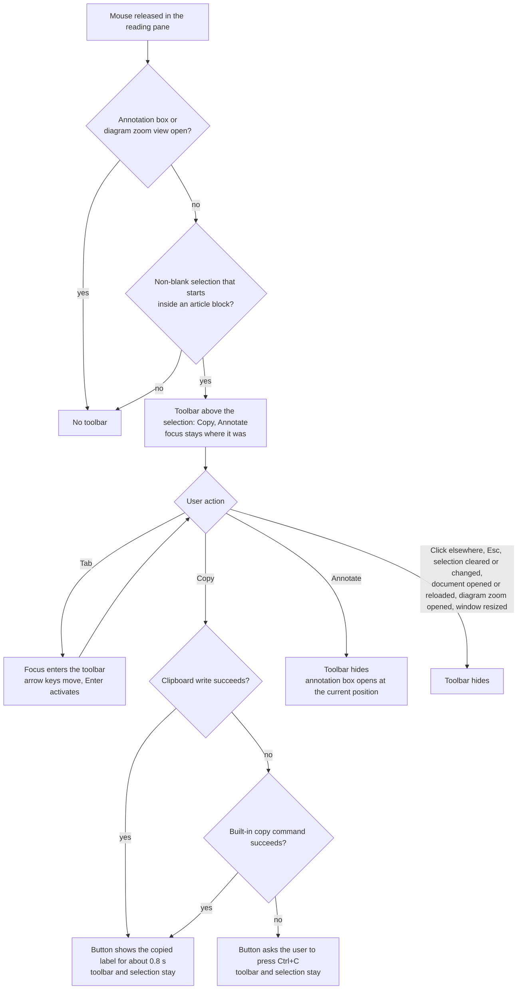

# selection-actions Specification

## Purpose
After the reader selects text in the document, offer a small toolbar with Copy and Annotate instead of opening the annotation box directly, without breaking normal reading and keyboard selection habits.
## Requirements
### Requirement: Selection toolbar for article text
When the user releases the mouse button in the reading pane, the page SHALL show a selection toolbar instead of opening the annotation box, provided the selection is not blank and starts inside a rendered article block.
"Not blank" means the selected text is non-empty after collapsing whitespace and
trimming. "Inside a rendered article block" means that walking up from the
selection's start reaches an element carrying `data-line` inside `#docInner`; the
welcome screen and the left and right panels never qualify. The check SHALL run
after the browser has settled the selection, so double-click (one word) and
triple-click (one paragraph) selections also show the toolbar. A drag selection
inside a rendered diagram (`.mermaid`) SHALL also show the toolbar, so diagrams can
still be annotated.

The toolbar SHALL contain exactly two buttons, "Copy" / 「複製」 and "Annotate" /
「加註」. It SHALL NOT appear while the annotation box is open, while the diagram
zoom view is open, or when the mouse is released on the toolbar itself, the
annotation box, the back-to-top button or a diagram's zoom button.

When the toolbar appears it SHALL record three values from that moment: the block's
line number, the quote (whitespace collapsed to single spaces and trimmed, as used for
annotations), and the raw selection text (`Selection.toString()`, keeping line breaks
between paragraphs, as used for copying).

The toolbar SHALL be an element inside `#doc`, after `#docInner` and before the
back-to-top button, so re-rendering the document does not remove it. It SHALL be
absolutely positioned in the scrolled content of `#doc` (`#doc` is
`position: relative`) so it moves with the text when the document scrolls.
Horizontally it SHALL be aligned with the point where the mouse was released and
kept inside the reading pane; vertically it SHALL sit above the selected line at that
point, or below it when there is not enough room above. The toolbar SHALL be
`user-select: none` and its buttons SHALL prevent the browser's default action on
`mousedown`, so pressing them does not change or clear the selection. While hidden it
SHALL carry the `hidden` attribute, so its buttons cannot be reached with Tab and are
not exposed to screen readers.

The welcome text shown when no document is open (`doc.empty`) SHALL describe the new
flow: select text, then press "Copy" or "Annotate".

#### Scenario: Selecting a phrase shows the toolbar
- **WHEN** the user drags across a phrase in a paragraph and releases the mouse
- **THEN** the selection toolbar with "Copy" and "Annotate" appears above the selection
- **AND** the annotation box does not open and keyboard focus has not moved

#### Scenario: Toolbar moves with the text
- **WHEN** the toolbar is shown and the user scrolls the document a little
- **THEN** the toolbar stays next to the selected text and remains visible

#### Scenario: Not enough room above
- **WHEN** the user selects text on the first visible line at the top of the reading pane
- **THEN** the toolbar appears below that line, inside the reading pane

#### Scenario: Selection outside the article
- **WHEN** the user selects text in the welcome screen, the left list or the annotations panel
- **THEN** no selection toolbar appears

#### Scenario: Double-click on a diagram opens the zoom view only
- **WHEN** the user double-clicks a rendered diagram, which both selects a word and opens the diagram zoom view
- **THEN** the zoom view opens and no selection toolbar appears

#### Scenario: Drag selection inside a diagram
- **WHEN** the user drags across text inside a rendered diagram and releases the mouse
- **THEN** the selection toolbar appears, and "Annotate" records the diagram's line number

#### Scenario: Pressing a toolbar button keeps the selection
- **WHEN** the user presses the mouse button on "Copy" or "Annotate"
- **THEN** the selected text in the article is still selected

#### Scenario: Hidden toolbar is not reachable
- **WHEN** no toolbar is shown and the user tabs through the page
- **THEN** focus never lands on the toolbar's buttons

#### Scenario: Welcome text describes the new flow
- **WHEN** no document is open, in either English or Traditional Chinese
- **THEN** the welcome text says to select text and then press "Copy" or "Annotate"

### Requirement: Copy selected text
Pressing "Copy" SHALL put only the selected text, as plain text, on the clipboard.
The copied text SHALL be the raw selection text recorded when the toolbar appeared, so
line breaks between paragraphs are kept; it SHALL NOT be the whitespace-collapsed
quote, and no HTML or other formatting SHALL be placed on the clipboard.

The page SHALL try, in order:

1. `navigator.clipboard.writeText` with the text.
2. When that is rejected: `document.execCommand("copy")`, with a one-time `copy`
   event handler registered just before it that sets the clipboard's `text/plain`
   data to the same text and prevents the default content, so this path also places
   plain text only.
3. When both fail: change the button label to "Press Ctrl+C" / 「請按 Ctrl+C」 (on
   macOS "Press ⌘C" / 「請按 ⌘C」), keeping the toolbar and the selection so the user
   can press the shortcut. No `prompt()` dialog SHALL be shown.

On success the button label SHALL change to "✓ Copied" / 「✓ 已複製」 for about 0.8
seconds and then return to "Copy" / 「複製」; the toolbar SHALL stay open so the user
can press "Annotate" next.

The page SHALL contain a persistent, visually hidden live region
(`aria-live="polite"`) outside the toolbar. On success it SHALL receive "Selected text
copied" / 「已複製選取的文字」; when both copy paths fail it SHALL receive "Couldn't copy
automatically. Press Ctrl+C" / 「無法自動複製，請按 Ctrl+C」, naming the same shortcut
as the button (⌘C on macOS).

#### Scenario: Copy across two paragraphs
- **WHEN** the user selects the end of one paragraph and the start of the next, presses "Copy", and pastes into a plain-text editor
- **THEN** the pasted text is exactly the selected text with the line break between the paragraphs kept

#### Scenario: Only plain text is placed
- **WHEN** the user copies a selection that contains bold text and a link, and pastes into a rich-text editor
- **THEN** the pasted text carries no bold or link formatting

#### Scenario: Copy succeeds
- **WHEN** the user presses "Copy" and the clipboard write succeeds
- **THEN** the button shows "✓ Copied" / 「✓ 已複製」 for about 0.8 seconds and then "Copy" / 「複製」 again
- **AND** the toolbar is still shown and the live region announces "Selected text copied" / 「已複製選取的文字」

#### Scenario: Clipboard API rejected
- **WHEN** `navigator.clipboard.writeText` is rejected and the built-in copy command succeeds
- **THEN** the clipboard holds only the selected text as plain text and the success feedback is shown

#### Scenario: Both copy paths fail
- **WHEN** both the clipboard API and the built-in copy command fail
- **THEN** the button reads "Press Ctrl+C" / 「請按 Ctrl+C」 (「請按 ⌘C」 / "Press ⌘C" on macOS), the selection is still in place, and the live region announces that automatic copy failed
- **AND** no dialog is shown

#### Scenario: Copy, then annotate
- **WHEN** the user presses "Copy" and then "Annotate"
- **THEN** the annotation box opens with the same quote

### Requirement: Annotate from the toolbar
Pressing "Annotate" SHALL hide the toolbar, set the pending annotation to the line number and quote recorded when the toolbar appeared, and open the annotation box.
The annotation box's position SHALL be computed at that moment, not from the
coordinates recorded at mouse release, because the user may have scrolled since. The
reference rectangle SHALL be the selection's current position in the viewport when
the selection is still present and unchanged, and otherwise the toolbar's position in
the viewport just before it was hidden.

The box SHALL be made visible first and then positioned using its actual size
(`offsetWidth`, `offsetHeight`): below the reference rectangle by default, above it
when it does not fit below, and finally clamped so that every edge is at least 12px
inside the viewport. The box's maximum height SHALL be the viewport height minus 24px,
with its content scrolling in shorter windows. Its width SHALL be about 340px and
never more than the viewport width minus 24px.

As before, opening the box SHALL move focus into the comment input, Ctrl+Enter SHALL
save and "Cancel" / 「取消」 SHALL close it. Esc SHALL close the box wherever focus is
inside it, including on a kind option. When the box closes, focus SHALL return to the
reading pane (`#doc`).

#### Scenario: Annotate after scrolling
- **WHEN** the user selects text, scrolls the document so the selection moves up, and then presses "Annotate"
- **THEN** the annotation box opens next to the selection's current position, fully inside the viewport

#### Scenario: Short window
- **WHEN** the window is shorter than the annotation box's natural height and the user presses "Annotate"
- **THEN** the box stays at least 12px inside every viewport edge and its content can be scrolled

#### Scenario: Selection near the right edge
- **WHEN** the selection ends near the right edge of a narrow window and the user presses "Annotate"
- **THEN** the box's right edge is at least 12px inside the viewport

#### Scenario: Esc on a kind option
- **WHEN** focus is on a kind option in the annotation box and the user presses Esc
- **THEN** the box closes without saving and focus is on the reading pane

### Requirement: Toolbar dismissal
The selection toolbar SHALL hide when any of the following happens: a mouse button is pressed outside the toolbar; Esc is pressed; the selection is cleared or changed; the annotation box opens; a document is opened or the current one is reloaded; the diagram zoom view opens; or the window is resized.
"Selection changed" SHALL be detected with the `selectionchange` event: the toolbar
hides when the selection becomes empty or its text differs from the raw text recorded
when the toolbar appeared. When the mouse press outside the toolbar starts a new
selection in the article, the toolbar SHALL appear again at the new position when the
mouse is released, under the rules of "Selection toolbar for article text". When Esc
is pressed while focus is inside the toolbar, focus SHALL move to the reading pane.

When the user made the selection with the mouse and the toolbar hid because the
selection was then adjusted with Shift and the arrow keys, releasing Shift SHALL show
the toolbar again next to the adjusted selection, provided the selection is still not
blank, still starts inside a rendered article block, and neither the annotation box
nor the diagram zoom view is open. The toolbar SHALL then record the line number,
quote and raw text of the adjusted selection, SHALL be aligned horizontally with the
end of the selection that was moved, and SHALL NOT take keyboard focus. Releasing
Shift SHALL NOT show the toolbar for a selection made with the keyboard alone.

#### Scenario: Click elsewhere
- **WHEN** the toolbar is shown and the user clicks an empty area of the article
- **THEN** the toolbar hides

#### Scenario: New selection while the toolbar is shown
- **WHEN** the toolbar is shown and the user drags across a different phrase
- **THEN** the old toolbar hides and a toolbar appears for the new selection when the mouse is released

#### Scenario: Esc
- **WHEN** the toolbar is shown and the user presses Esc
- **THEN** the toolbar hides

#### Scenario: Selection cleared by script or keyboard
- **WHEN** the toolbar is shown and the selection becomes empty or its text changes without a mouse release
- **THEN** the toolbar hides

#### Scenario: Mouse selection adjusted with Shift and arrow keys
- **WHEN** the user selects a phrase with the mouse, holds Shift, extends the selection with the arrow keys and then releases Shift
- **THEN** the toolbar appears again next to the new selection and keyboard focus has not moved
- **AND** pressing "Copy" copies the extended selection

#### Scenario: Window resized
- **WHEN** the toolbar is shown and the browser window is resized
- **THEN** the toolbar hides

#### Scenario: Another document opened
- **WHEN** the toolbar is shown and the user opens another document from the left list
- **THEN** the toolbar is hidden when the new document is shown

### Requirement: Keyboard operation
The selection toolbar SHALL NOT take keyboard focus when it appears; focus SHALL stay where it was, so Space still scrolls the page, Shift with arrow keys still adjusts the selection, and typing is not captured by a toolbar button.
The toolbar SHALL have `role="toolbar"` and an accessible name from the active locale
(`aria-label` "Actions for selected text" / 「選取文字的動作」); both buttons SHALL be
real `<button>` elements.

While the toolbar is shown and focus is not inside it, pressing Tab without Shift
SHALL move focus to the toolbar's first button ("Copy") instead of following the
document's normal Tab order, which would otherwise pass every link after the selection
first. Shift+Tab SHALL NOT be intercepted.

Inside the toolbar the page SHALL follow the WAI-ARIA Authoring Practices pattern for
toolbars: only one button is in the Tab order at a time; Left and Right arrow keys
move focus between the two buttons, and Home and End move to the first and last;
Enter or Space activates the focused button; Tab leaves the toolbar; Esc hides it and
moves focus to the reading pane.

The reading pane `#doc` SHALL have `tabindex="-1"` so focus can be placed on it by
script without adding it to the Tab order, and it SHALL show no focus outline.

#### Scenario: Space still scrolls
- **WHEN** the toolbar has just appeared and the user presses Space
- **THEN** the page scrolls as before and no toolbar button is activated

#### Scenario: Tab enters the toolbar
- **WHEN** the toolbar is shown, focus is outside it, and the user presses Tab
- **THEN** focus is on the "Copy" button

#### Scenario: Arrow keys and Enter
- **WHEN** focus is on "Copy" and the user presses Right arrow and then Enter
- **THEN** focus moved to "Annotate" and the annotation box opens

#### Scenario: Tab leaves the toolbar
- **WHEN** focus is on a toolbar button and the user presses Tab
- **THEN** focus leaves the toolbar instead of moving to the other toolbar button

#### Scenario: Esc from inside the toolbar
- **WHEN** focus is on a toolbar button and the user presses Esc
- **THEN** the toolbar hides and focus is on the reading pane

#### Scenario: Screen reader announces the toolbar
- **WHEN** a screen reader user moves focus into the toolbar
- **THEN** the toolbar is announced as a toolbar named "Actions for selected text" / 「選取文字的動作」

### Requirement: Open annotation box is not interrupted
While the annotation box is open, selecting text in the article SHALL NOT show the selection toolbar and SHALL NOT change the annotation box's quote, line number, chosen kind or comment.
Such a selection SHALL behave as an ordinary browser selection (for example, Ctrl+C
copies it). To annotate a different passage the user first presses "Cancel" or saves.

#### Scenario: Selecting while writing a comment
- **WHEN** the annotation box is open with a half-written comment and the user selects another sentence in the article
- **THEN** no toolbar appears and the box still shows the original quote, chosen kind and half-written comment

#### Scenario: Copying while the box is open
- **WHEN** the annotation box is open and the user selects text and presses Ctrl+C
- **THEN** the selected text is copied by the browser and the annotation box is unchanged

### Requirement: Annotation box closes when another document opens
Opening a document, or reloading the current one, SHALL first close the annotation box and hide the selection toolbar, before anything else is loaded.
Any comment typed in the box SHALL be discarded without asking, exactly as if
"Cancel" had been pressed, so it is never saved to the newly opened document.

#### Scenario: Draft discarded when switching documents
- **WHEN** the annotation box is open with a typed comment and the user opens another document from the left list
- **THEN** the annotation box is closed, the new document's sidecar receives no annotation, and the previous document's sidecar is unchanged

#### Scenario: Reload closes the box
- **WHEN** the annotation box is open and the user presses the reload button
- **THEN** the annotation box is closed after the document is reloaded and no annotation was added
