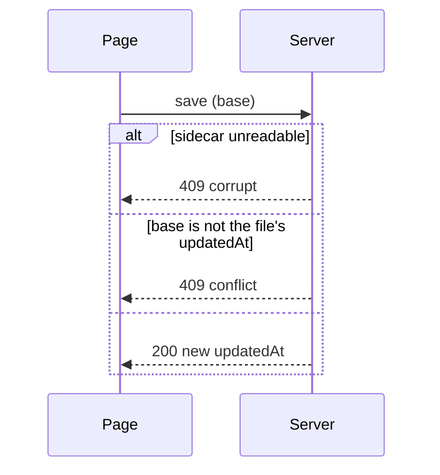

# sidecar-integrity Specification

## Purpose
Protect the annotation sidecar from silent data loss: never overwrite a file that cannot be read, never let an out-of-date tab overwrite newer changes, and keep fields a given version does not manage.
## Requirements
### Requirement: Unreadable sidecar is never overwritten
When a sidecar file exists but cannot be parsed as JSON, the server SHALL report it
from `/api/file` (`sidecarError`) and SHALL refuse every write to it with HTTP 409.
The page SHALL show a persistent notice that the file is damaged or has merge-conflict
markers, and SHALL NOT attempt to save until it is reloaded after a fix.

#### Scenario: Merge-conflict markers
- **WHEN** a sidecar contains git conflict markers and the user opens its document
- **THEN** the page shows the damaged-sidecar notice and the sidecar file is not modified by any later action on the page

### Requirement: Writes keep fields they do not manage
`/api/save` SHALL replace only `annotations` (and `file`, `schema`, `updatedAt`), and
`/api/review` SHALL replace only `review` (and `updatedAt`); every other top-level
field of the existing sidecar SHALL be kept. Annotation objects SHALL be sent from a
single field whitelist that includes `context`, so values computed in memory are
never written.

#### Scenario: Saving annotations keeps the review record
- **WHEN** a document is marked complete and the user then resolves an annotation
- **THEN** the sidecar still contains the same `review` field

#### Scenario: Unknown field from a newer version
- **WHEN** the sidecar has a top-level field this version does not know and the user saves
- **THEN** that field is still present after the save

### Requirement: Out-of-date writes are refused
Every write SHALL carry the `updatedAt` the page last saw (`base`, null when there
was no sidecar). The server SHALL refuse the write with HTTP 409 when `base` differs
from the sidecar's current `updatedAt`, and the page SHALL ask the user to reload
and stop autosaving until it does. Writes from one page SHALL be sent one at a time
so that they never conflict with each other.

#### Scenario: Two tabs on the same document
- **WHEN** tab B saves an annotation and tab A, opened earlier, then saves
- **THEN** tab A's save is refused, tab B's annotation is kept, and tab A shows the reload prompt

#### Scenario: Own consecutive saves
- **WHEN** the user marks a document complete and immediately adds an annotation in the same tab
- **THEN** both writes succeed in order

---
🤖 claude-opus-5-5[1m] · effort: xhigh · 2026-10-08

