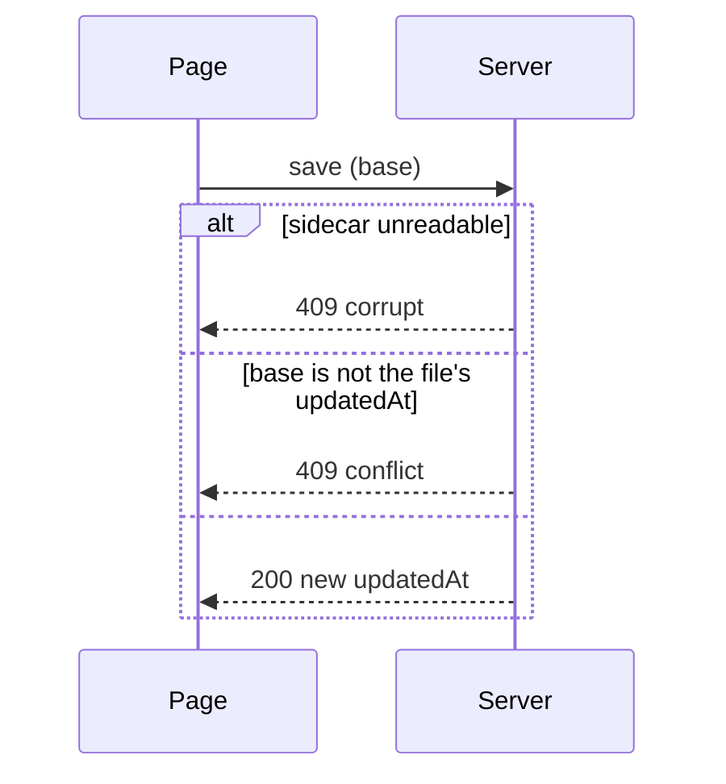
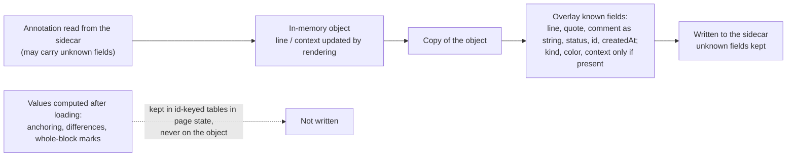

# sidecar-integrity Specification

## Purpose
Protect the annotation sidecar from silent data loss: never overwrite a file that cannot be read, never let an out-of-date tab overwrite newer changes, and keep fields a given version does not manage.
## Requirements
### Requirement: Unreadable sidecar is never overwritten
When a sidecar file exists but cannot be parsed as JSON, the server SHALL report it
from `/api/file` (`sidecarError`) and SHALL refuse every write to it with HTTP 409.
The page SHALL show a persistent notice that the file is damaged or has merge-conflict
markers, and SHALL NOT attempt to save until it is reloaded after a fix.

#### Scenario: Merge-conflict markers
- **WHEN** a sidecar contains git conflict markers and the user opens its document
- **THEN** the page shows the damaged-sidecar notice and the sidecar file is not modified by any later action on the page

### Requirement: Writes keep fields they do not manage
`/api/save` SHALL replace only `annotations` (and `file`, `schema`, `updatedAt`), and
`/api/review` SHALL replace only `review` (and `updatedAt`); every other top-level
field of the existing sidecar SHALL be kept. Each annotation SHALL be written as a
copy of the in-memory annotation object with the known fields overlaid with their
normalized values, so annotation fields this version does not know are kept too.

The in-memory annotation object is the object read from the sidecar, so any field a
newer version added is already on it. The known fields SHALL be overlaid as follows:
`line`, `quote`, `comment` (always a string, `""` when missing), `status`, `id` and
`createdAt` always; `kind`, `color` and `context` only when the object has a value for
them. A field the object does not have SHALL NOT be added: an older annotation SHALL
NOT gain a `kind`, and a new annotation SHALL NOT gain a `color`. The merge SHALL be
the shared pure function `annToSave(a)` in `reviewer-diff.js`, used by both export and
autosave.

Values the page computes after loading (anchoring results, old/new differences,
whether a highlight fell back to the whole block, and any similar derived value) SHALL
NOT be stored on annotation objects; they SHALL be kept in id-keyed tables or sets in
page state. The `line` and `context` that rendering writes back are known fields that
are meant to be saved and are not derived values in this sense. This rule SHALL be
stated in a comment next to the save function in `reviewer.js`.

A kept unknown field may be stale: this version can change known fields (for example
`line` on load or `kind` when the user changes it) without updating a newer version's
field that depends on them. A later version that reads a field it added SHALL
therefore treat its value as possibly left by an older version and SHALL check or
recompute it against the known fields before relying on it.

#### Scenario: Saving annotations keeps the review record
- **WHEN** a document is marked complete and the user then resolves an annotation
- **THEN** the sidecar still contains the same `review` field

#### Scenario: Unknown field from a newer version
- **WHEN** the sidecar has a top-level field this version does not know and the user saves
- **THEN** that field is still present after the save

#### Scenario: Unknown annotation field from a newer version
- **WHEN** an annotation in the sidecar has a field this version does not know and the user resolves a different annotation
- **THEN** after the save that annotation still has the field with the same value

#### Scenario: Older annotation written back unchanged
- **WHEN** an annotation with `color` and no `kind` is passed through `annToSave` without its line having changed
- **THEN** the result has exactly the same fields and values as the input, with no `kind` added

#### Scenario: Missing comment saved as an empty string
- **WHEN** an annotation without a `comment` field is saved
- **THEN** the saved annotation has `"comment": ""`

#### Scenario: Computed values are not written
- **WHEN** a document whose annotations include changed, removed and whole-block-marked ones is saved
- **THEN** no saved annotation contains anchoring results, differences or a whole-block flag

### Requirement: Out-of-date writes are refused
Every write SHALL carry the `updatedAt` the page last saw (`base`, null when there
was no sidecar). The server SHALL refuse the write with HTTP 409 when `base` differs
from the sidecar's current `updatedAt`, and the page SHALL ask the user to reload
and stop autosaving until it does. Writes from one page SHALL be sent one at a time
so that they never conflict with each other.

#### Scenario: Two tabs on the same document
- **WHEN** tab B saves an annotation and tab A, opened earlier, then saves
- **THEN** tab A's save is refused, tab B's annotation is kept, and tab A shows the reload prompt

#### Scenario: Own consecutive saves
- **WHEN** the user marks a document complete and immediately adds an annotation in the same tab
- **THEN** both writes succeed in order
